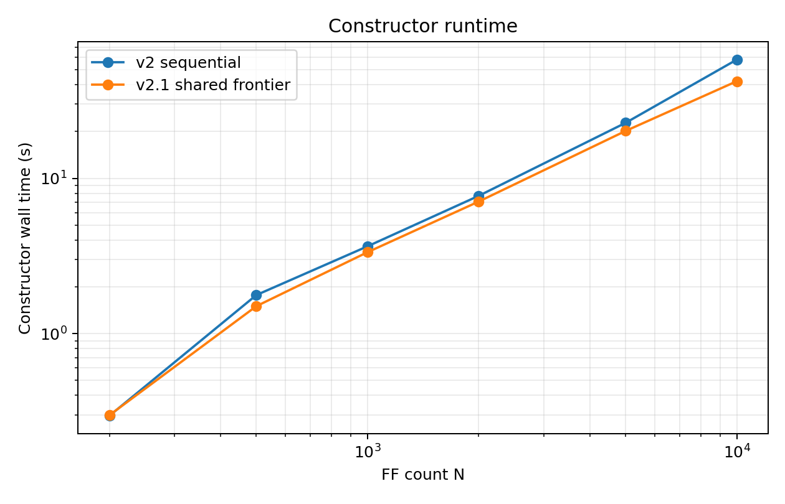
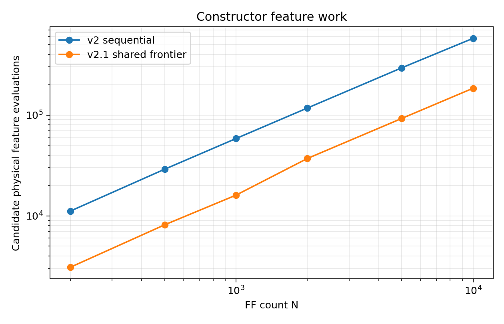
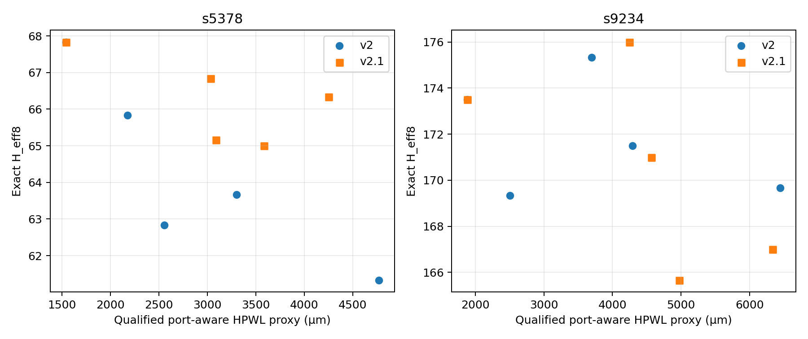

# PACT Optimizer-v2.1 Shared-Frontier Constructor Report

## Result and classification

**PACT_V2_1_SHARED_FRONTIER_ADVANCE**

The shared-frontier constructor materially reduces the measured large-N
constructor bottleneck without changing either authoritative objective. At
N=10,000 it reduced isolated constructor time from 58.073 s to 42.156 s
(1.38x), candidate scores by 61.9%, physical feature computations by 68.0%,
and constructor-only peak traced memory from 37.19 MiB to 19.08 MiB. Total
optimizer time fell from 80.558 s to 68.783 s (1.17x), with the same eight
exact evaluations.

The improvement has a crossover. N=200 is neutral and has worse total time;
N=500-5,000 constructor speedups are 1.09-1.18x, with total speedups ranging
from 0.97x to 1.20x. The classification rests on the measured target regime,
the material N=10,000 reduction, linear sparse storage, correctness evidence,
and the retained real-design physical safety anchor. It is not a claim that
construction has ceased to be the largest block.

## Baseline bottleneck

The frozen pre-edit state was commit
`088dcbb1099788287ccec7dcd664da516bac8ad1`, clean. The relevant v2 unit suite
passed 5/5 before edits. The committed N=1,000 profile measured 6.027 s in
`construct_architectures_v2` out of 9.497 s total, with five independent
`construct_orders` calls consuming 4.700 s cumulatively. A fresh pre-edit run
and all start hashes/objectives are preserved in
`reports/optimizer_v2_1/baseline_summary.json`; no v2 historical artifact was
modified.

## Old constructor

V2 builds one complete architecture per lambda lane. It chooses a lane-specific
head for each chain, then repeatedly appends one FF to each non-full tail from
a bounded union of physical graph neighbors, a shared activity-neighbor index,
and deterministic non-local candidates. Candidate geometry and activity are
then rescored independently by each lane. Capacity is fixed by the input chain
lengths. This is expected O(LN(k+a+r)) work for L lanes and fixed sparse bounds,
but it repeats the outer walk and pair-feature extraction L times.

## New shared-frontier sparse regret constructor

V2.1 uses one common O(N) unassigned inventory and one bounded active FF
frontier for the non-physical lanes. A frontier record for FF `x` contains, per
lane, up to two legal tail insertion opportunities `(x, chain, predecessor,
SO)`. Each opportunity stores its exact qualified physical insertion delta,
activity-compatibility delta, scalar score, arc version, and chain metadata.
For each FF the best and second-best scalar costs define deterministic regret;
aggregate regret and best cost order the common frontier. The chosen FF is
inserted once into every lane, while each lane independently takes its own best
legal opportunity. Scalarization is confined to construction.

The implementation deliberately retains one optimized v2 physical-greedy
safety anchor. This reproduces the old physical start exactly and prevents a
shared FF admission sequence from destroying the real-design physical extreme.
The other four fixed lanes are produced by the common regret frontier. The
anchor is included in every timing/work count; this compromise is a measured
quality safeguard, not hidden baseline work.

## Data structures and sparse-state bound

- `SparsePhysicalGraph`: fixed-width Manhattan kNN arrays, O(kN).
- Swap-delete unassigned-node pool: O(N).
- Common active frontier: at most four resident FF records by default.
- Per record: at most two opportunities per shared lane.
- Bounded candidate-feature cache: at most `4N` entries.
- Bounded directed activity cache: at most `8N` entries.
- Per-lane chain lists, endpoint versions, and capacities: O(N + LK).

No N-by-N matrix or permutation enumeration is introduced. With fixed L, k,
activity bound, frontier bound, and opportunities per FF, expected construction
time and designed memory are O(N). The physical anchor is another sparse O(N)
walk.

## Lazy invalidation invariant

An opportunity may be accepted only if all of the following hold:

1. `x` is still unassigned;
2. the target chain remains below its frozen capacity;
3. the stored arc version equals the current version for that lane and chain;
4. the stored predecessor is still the current chain tail; and
5. the successor remains SO.

Inserting `x` into `a -> SO` creates `a -> x -> SO` and increments only that
lane/chain version. Other chains and lanes are not globally rebuilt. Obsolete
frontier records may remain resident, but the selected record is version-
checked and locally rebuilt before acceptance. The controlled N=10,000 run
observed 895 stale candidates, all rejected; no stale entry was accepted.

## Correctness evidence

`tests/unit/test_optimizer_v2_1.py` adds deterministic properties for:

- complete, duplicate-free K-chain architectures with exact frozen capacities;
- randomized cached physical insertion deltas versus independent full chain
  cost differences;
- activity-delta agreement with independent chain-score differences;
- stale version rejection and refreshed-entry agreement;
- shared feature reuse versus independent scalar score calculation; and
- canonical-digest determinism for identical seed/configuration.

The combined relevant suite passes 10/10, including all original v2 tests.
The optimizer still reports the qualified port-aware Manhattan objective and
exact H_eff8 separately; no exact H_eff8 work was added to insertion screening.

## Controlled synthetic scaling

All rows use identical coordinates, patterns, weights, K, graph k=12, seed
20260921, five lambda labels, capacities, eight exact evaluations, and two
local moves. Times and memory are directly measured with tracemalloc enabled.
Synthetic rows characterize software scaling only.

| N | Old ctor (s) | New ctor (s) | Ctor speedup | Old scored | New scored | Reduction | Old ctor MiB | New ctor MiB | Old total (s) | New total (s) | Total speedup |
| ---: | ---: | ---: | ---: | ---: | ---: | ---: | ---: | ---: | ---: | ---: | ---: |
| 200 | 0.296 | 0.298 | 0.99x | 11,137 | 4,216 | 62.1% | 0.44 | 0.27 | 0.516 | 0.718 | 0.72x |
| 500 | 1.770 | 1.501 | 1.18x | 28,981 | 10,686 | 63.1% | 1.59 | 0.48 | 2.825 | 2.918 | 0.97x |
| 1,000 | 3.646 | 3.342 | 1.09x | 58,414 | 21,278 | 63.6% | 3.78 | 1.08 | 6.352 | 5.302 | 1.20x |
| 2,000 | 7.705 | 7.080 | 1.09x | 117,255 | 43,955 | 62.5% | 7.59 | 3.20 | 12.591 | 11.860 | 1.06x |
| 5,000 | 22.753 | 20.174 | 1.13x | 293,750 | 110,146 | 62.5% | 18.51 | 9.31 | 35.126 | 34.535 | 1.02x |
| 10,000 | 58.073 | 42.156 | 1.38x | 576,366 | 219,829 | 61.9% | 37.19 | 19.08 | 80.558 | 68.783 | 1.17x |

At N=10,000, exact physical feature computations fell from 576,366 to 184,280
(68.0%). V2.1 made 35,549 candidate-cache hits, of which 35,411 were
cross-lane equivalent evaluations avoided. The maximum live common frontier
contained 40 lane-opportunity entries, while caches remained explicitly linear.

Constructor-only memory improves materially, but total optimizer peak is
essentially unchanged at N=10,000 (55,461,296 versus 55,465,492 bytes) because
exact H_eff8 state and boundary materialization, not the constructor frontier,
dominate the whole-run peak.

## Real benchmark start-front sanity check

No routing was run. Both designs used frozen seed 11, K=2 proxy inputs, exact
qualified port-aware Manhattan scan HPWL, and exact H_eff8.

| Design | Old/new ctor (s) | Candidate scores old/new | Old start reproduced | Old starts dominated by new | New starts dominated by old | New combined-front starts | Total optimizer old/new (s) |
| --- | ---: | ---: | --- | ---: | ---: | ---: | ---: |
| s5378 | 0.265 / 0.566 | 8,735 / 3,995 | physical greedy | 0 | 4 | 1 | 4.873 / 4.806 |
| s9234 | 0.499 / 0.518 | 10,091 / 4,556 | physical greedy | 2 | 2 | 2 | 7.219 / 7.536 |

For s5378, v2.1 reproduces the old best-physical point exactly at
(1541.11 µm, 67.8333) but the four new non-physical starts are dominated by the
old portfolio. Its best H_eff8 is 65.0 versus 61.3333 for v2. This is a measured
quality-for-sharing trade, not quality preservation.

For s9234, v2.1 also reproduces the old physical point exactly at
(1882.105 µm, 173.5). Two new starts lie on the combined nondominated front;
the best new H_eff8 is 165.6667 versus 169.3333 for the old starts, at higher
physical cost. Two old starts and two new starts are cross-dominated.

The physical anchor means neither real portfolio catastrophically loses its
qualified physical extreme. Real constructor timing does not improve at these
small N values; the speed result is a large-N software-scaling result.

## Limitations and failure cases

- Fixed shared-frontier overhead hurts N=200 and can erase total-speed gains at
  small and mid-size cases.
- Production opportunities are tail/SO insertions; the general versioned
  insertion implementation and tests cover arbitrary predecessor/successor
  arcs, but broader live inner-arc admission was too allocation-heavy in Python.
- A common FF admission sequence reduces non-physical diversity on s5378.
- The sequential physical anchor is required by the measured real quality
  result and consumes extra work; removing it was faster but left every s5378
  new start dominated.
- Synthetic N=10,000 evidence is not an industrial-scale claim.

## One remaining measured dominant bottleneck

The newly measured dominant sub-block is **active-frontier admission and record
rebuilding**. In the N=1,000 post-change cProfile run,
`construct_architectures_v2_1` took 4.386 s of 6.408 s total under profiling;
`admit` consumed 1.335 s cumulatively and `build_record` 1.221 s. The shared
activity-neighbor build was 1.100 s and the physical anchor 0.540 s. Therefore
the next narrow optimization target, if pursued, is compact/vectorized frontier
record construction—not H_eff8, routing, a dense matrix, or an Optimizer-v3.

## Evidence files

- `reports/optimizer_v2_1/baseline_summary.json`
- `reports/optimizer_v2_1/scaling_results.json`
- `reports/optimizer_v2_1/scaling_summary.csv`
- `reports/optimizer_v2_1/real_benchmark.json`
- `reports/optimizer_v2_1/profile_top.txt`
- `reports/optimizer_v2_1/figures.json`
