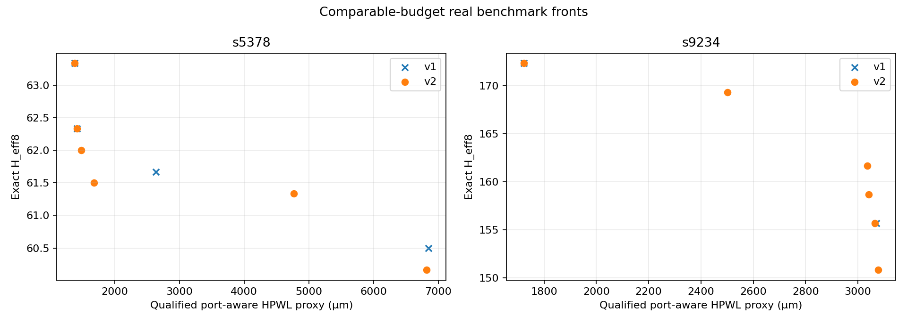
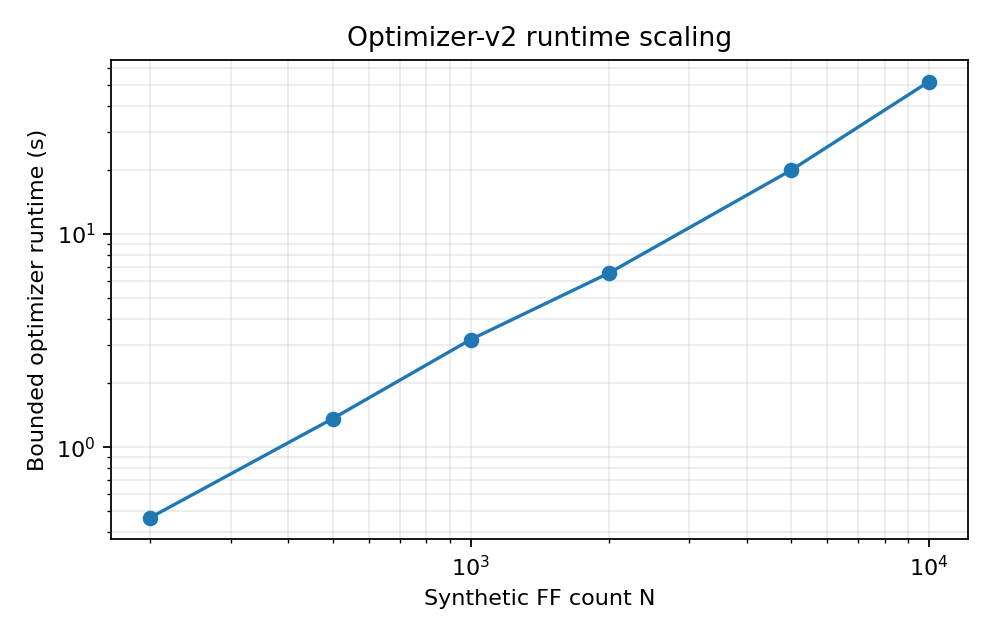
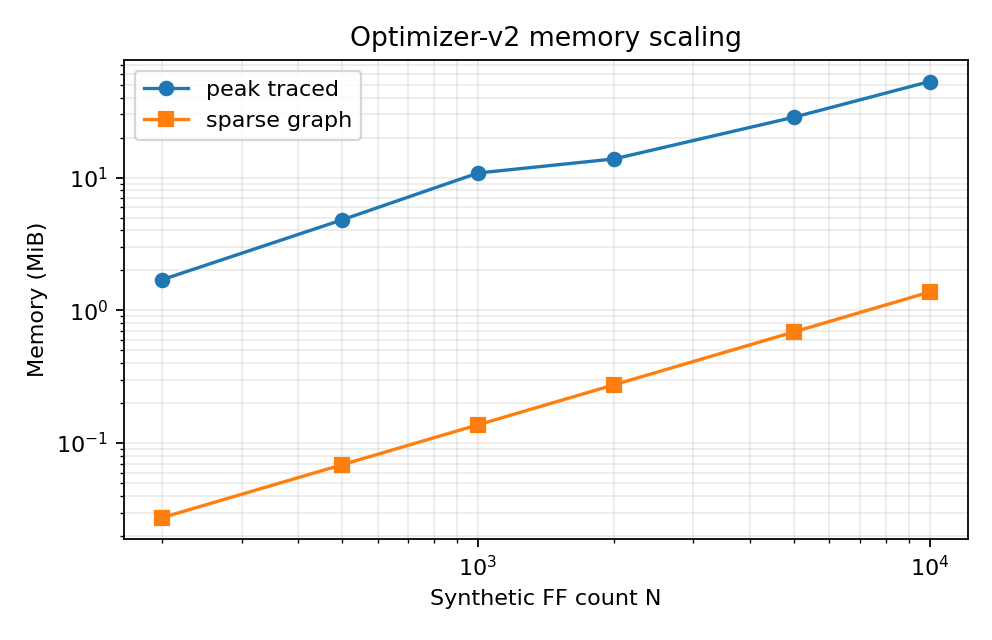
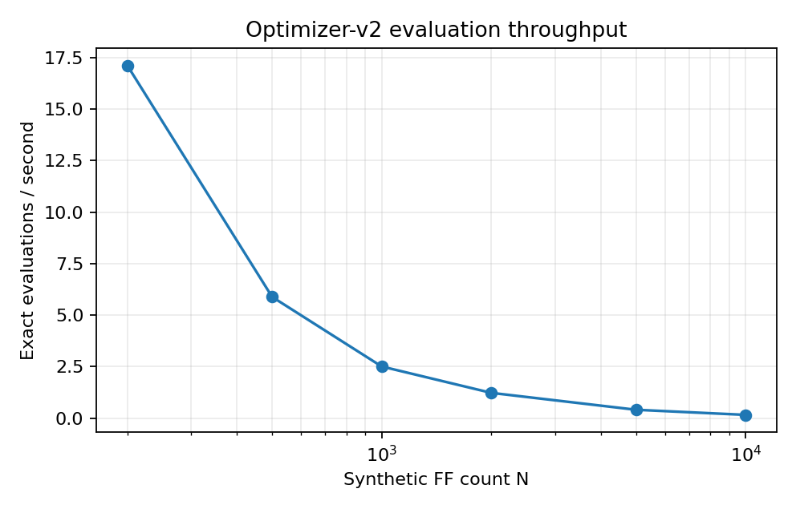
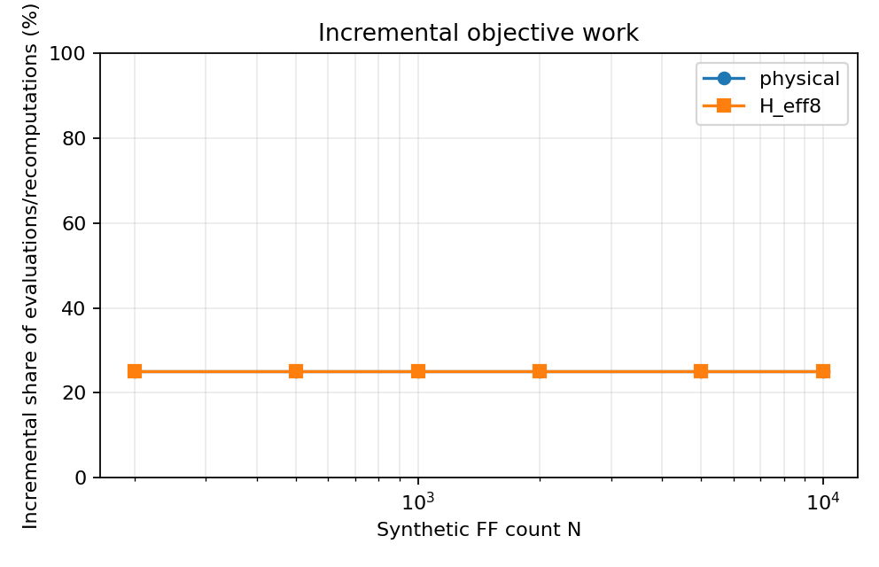

# PACT Optimizer-v2 Scalable Search Report

## Problem

For `N` scan FFs and exactly `K` ordered chains, PACT optimizes

`A = {C1, C2, ..., CK}`

subject to every FF appearing exactly once, no duplicates or omissions, exactly
`K` valid SI-to-SO chains, fixed FF identity/placement, and the existing exact
parallel-loading/test-quality semantics. The only minimized objectives remain:

1. the qualified port-aware FF-origin Manhattan scan HPWL proxy; and
2. exact H_eff8 from the existing no-capture, fully clocked parallel-shift model.

Even for fixed balanced chain capacities, assignments and within-chain orders
form a combinatorial space. Treating candidates as complete permutations makes
hashing, copying, validation, construction, and objective evaluation scale with
all `N` FFs even when a move changes only a few scan arcs.

## Optimizer-v1 bottlenecks

The required pre-design audit is in
[`docs/PACT_OPTIMIZER_V2_BOTTLENECK_NOTE.md`](docs/PACT_OPTIMIZER_V2_BOTTLENECK_NOTE.md).
The main code-derived findings were:

- `ScanArchitecture` is an immutable and appropriate artifact format, but v1
  also uses it inside search. A local move copies all chains, copies them again
  for before-state tracking, rebuilds every tuple, constructs complete edge
  sets, validates all FFs, and repeatedly hashes canonical JSON: O(N) or
  O(N log N) work per proposal before objective evaluation.
- The v1 cheapest/regret constructor evaluates every remaining FF at every
  insertion position and sorts the options. Its implemented worst case is
  O(N^3 log N), not a sparse nearest-neighbor construction.
- Repairing `R` removed FFs rescans all insertion positions for every remaining
  removed FF, O(R^2 N log N) as implemented.
- V1's physical `replacement_delta` is exact, but it recomputes every changed
  chain, which is O(N) in the common K=2 case. The authoritative evaluator then
  recomputes the complete physical proxy again.
- Exact H_eff8 is recomputed from zero for every cache miss. Its streamed
  implementation is O(P L N) for `P` patterns and maximum chain length `L`,
  plus fixed-grid accumulation/convolution.
- Candidate records and complete architecture/proxy artifacts grow with the
  number evaluated; the Pareto archive is not capped.

The comparable real run quantified the constructor bottleneck. With a nominal
20-second wall limit and the same six qualified starts, v1 reached only those
six exact evaluations before its next indivisible constructor. It returned in
20.40 s for `s5378` and overshot to 30.76 s for `s9234`. This is a measured
algorithmic overrun, not routing time.

## Optimizer-v2 architecture

The inner representation uses contiguous `int32` arrays:

- predecessor and successor per FF;
- chain ID per FF;
- head, tail, and length per chain;
- fixed integer-to-name and placement mappings at the boundary.

Every local move writes through an undo log. Rejected moves restore only touched
slots. A 128-bit deterministic Zobrist-style key is updated from changed
directed, chain-labelled arcs; the canonical repository SHA-256 is computed
only for retained output architectures. Full snapshots are made for initial
starts, bounded-archive entries, parent restarts, and final output—not for each
considered move.

| Operation | Implemented complexity |
| --- | ---: |
| predecessor / successor / chain / endpoint lookup | O(1) |
| FF relocation or arbitrary swap | O(1) link writes |
| segment reversal | O(segment length) |
| cross-chain segment exchange | O(total exchanged length) |
| exact physical delta / incremental key | O(number of changed directed arcs) |
| reconstruction or full validation | O(N) |
| retained archive snapshot | O(N), only when retained |

The input/output boundary remains the existing `ScanArchitecture` JSON format.
No historical representation or qualified objective definition changed.

The search has explicit caps for wall time, exact evaluations, local moves,
archive size, candidate-neighborhood size, graph `k`, segment length, and seen
cache size. Time is checked between atomic exact evaluations, so the maximum
possible wall overrun is one in-flight exact evaluation. OpenROAD calls are
recorded as zero and no routing package is imported into the optimizer.

## Sparse graph

`SparsePhysicalGraph` builds exact Manhattan k-nearest neighbors with
`scipy.spatial.cKDTree(p=1)`. The fallback streams one O(N) Manhattan distance
row at a time, so fallback construction is O(N^2) time but still O(kN) stored
edges rather than an N-by-N matrix.

For the final deterministic scaling run, `k=12`:

| N | Directed edges | Graph build (s) | Graph memory |
| ---: | ---: | ---: | ---: |
| 200 | 2,400 | 0.028 | 28,800 B |
| 1,000 | 12,000 | 0.147 | 144,000 B |
| 5,000 | 60,000 | 0.788 | 720,000 B |
| 10,000 | 120,000 | 1.542 | 1,440,000 B |

Measured graph storage was exactly 144 bytes per FF at k=12 and the log-log
memory slope was 1.000. Measured construction slope was 1.045 over 200–10,000
FFs. The graph guides candidates but does not prohibit nonlocal arcs: every
constructor/search neighborhood includes deterministic random nonlocal
candidates, and exhausted local lists fall back to the remaining global pool.

## Search operators

The bounded engine implements:

- intra-chain FF swap;
- intra-chain FF relocation;
- 2-opt / directed segment reversal;
- inter-chain single-FF migration;
- inter-chain FF swap; and
- bounded segment exchange.

For every move, v2 records the exact removed and added directed arcs, including
SI/head and tail/SO arcs when endpoints change. Examples are `p→x, x→n`
becoming `p→n` on removal, followed by `a→b` becoming `a→x, x→b` on insertion.
Segment reversal changes every directed internal arc for hashing/activity even
though symmetric Manhattan costs cancel internally.

For a selected FF and operator, v2 screens at most the configured bounded
candidate set. Candidates combine spatial k-nearest neighbors, a sparse
activity-ranking index, and explicit random nonlocal choices. Screening uses
the exact physical arc delta and the existing clearly labelled target-
compatibility heuristic. Only the best bounded option consumes exact H_eff8
evaluation. Scalarized scores are used for constructors and active search lanes
only; archive membership always uses the two separate authoritative objectives.

The archive first applies strict Pareto dominance, then fixed objective-space
epsilon binning, then crowding pruning if necessary. It has a hard maximum size
and protects the best physical and best H_eff8 points.

## Incremental objectives

### Physical proxy

The qualified objective is edge additive:

`C(A) = Σchain [d(SI, head) + Σ d(FFi, FFi+1) + d(tail, SO)]`.

Therefore, for exact removed arcs `R` and added arcs `D`, v2 uses

`ΔC = Σ(e in D) d(e) - Σ(e in R) d(e)`.

The move tests compare `old + ΔC` against both the integer representation's
full arc sum and v1's authoritative `PhysicalCostModel.architecture_cost`.

### H_eff8

H_eff8 is not local in scan-order distance. A local change may alter every
cycle at every FF in an affected chain. V2 does not approximate this.

For chain `c`, let `Bc(t,g)` be its exact direct-sink-weighted toggle field at
cycle `t`, bin `g`, after the fixed spatial convolution. Scan chains shift
independently, accumulation/convolution are linear, and every pattern ends in
the architecture-independent ATPG target state. Thus

`E(t,g) = Σc Bc(t,g)` and `H_eff8 = max(t,g) E(t,g)`.

If only chains in set `S` change while `Lmax` is unchanged, v2 computes

`E' = E + Σ(c in S) [Bc,new - Bc,old]`

and takes the exact global maximum. The complete trajectory of every affected
chain and the complete global cycle/bin maximum still must be evaluated. If a
migration changes `Lmax`, leading-zero alignment changes for all chains and v2
explicitly performs a full exact H_eff8 recomputation.

The exact recurrence is vectorized as a Toeplitz state-history matrix, then
weighted into the same 8x8 bins and convolved with the unchanged kernel.

## Correctness

`tests/unit/test_optimizer_v2.py` provides deterministic property-style tests:

- 150 randomized moves across swap, relocation, 2-opt, cross-chain swap,
  segment exchange, and migration;
- exact physical delta versus two independent full recomputations;
- rollback to identical order and incremental key;
- predecessor/successor consistency, chain membership, no duplicates, and no
  missing FFs after every move;
- 60 randomized H_eff8 updates versus the authoritative
  `parallel_activity_metrics(..., grid_sizes=(8,))`, including Lmax-changing
  migration/full fallback;
- sparse graph shape/storage;
- Pareto dominance, archive cap, pruning, and preservation of both extremes;
- deterministic engine output and all resource caps.

The targeted suite passes. Final capped-archive outputs are also reconstructed,
fully validated, and subjected to a full physical recomputation; any mismatch
raises rather than being silently recorded.

## Search results

Both engines received the same six qualified Phase-0C starts for each design.
The comparison used seed 20260921, a nominal 20-second wall cap, 24 exact
evaluations, and 32 local moves. V1 could not reach its evaluation budget
because its next constructor consumed the remaining wall interval; v2 did.

| Design / engine | Wall (s) | Exact evals | Architectures considered | Final front | Best physical (µm) | Best H_eff8 | Peak traced memory |
| --- | ---: | ---: | ---: | ---: | ---: | ---: | ---: |
| s5378 v1 | 20.397 | 6 | 6 | 4 | 1380.830 | 60.500 | 1.35 MiB |
| s5378 v2 | 2.946 | 24 | 24 | 6 | 1380.830 | 60.167 | 51.76 MiB |
| s9234 v1 | 30.759 | 6 | 6 | 2 | 1723.945 | 155.667 | 1.73 MiB |
| s9234 v2 | 4.564 | 24 | 24 | 6 | 1723.945 | 150.833 | 81.14 MiB |

V2 screened 119 and 125 bounded move options, respectively, before 13 exact
incremental local evaluations per design. On `s5378`, some v2 point dominated
2/4 equal-input v1-front points and no v1 point dominated a v2 point. On
`s9234`, v2 dominated 1/2 v1 points; one v2 tradeoff point was dominated by a
v1 point. This is a set relationship, not a claim that every v2 point is better.

The comparison must also be read against the historical 60-second Optimizer-v1
`s5378` result: 24 exact evaluations reached best physical 1180.75 µm and best
H_eff8 59.0. The present v2 run did not reproduce those two historical extremes.
Therefore solution-quality preservation is demonstrated against the equal-
input, equal-budget baseline and the qualified starting portfolio, but not yet
against every point in the longer historical v1 LNS front. V2's contribution
in this phase is the scalable computational structure plus a real H_eff8
advance on both comparable runs, not universal dominance.

## Scaling results

These cases use synthetic coordinates, four deterministic synthetic patterns,
and K increasing to keep maximum chain length at 500. They are software
performance characterization only and are not scientific PACT benchmark
evidence. Every row uses the same fixed workload: six exact initial objectives,
two exact local evaluations, two local moves, k=12, maximum neighborhood 24,
and archive cap 12.

| N | K | Runtime (s) | Peak traced memory | Eval/s | Move/s | Avg neighborhood | Archive |
| ---: | ---: | ---: | ---: | ---: | ---: | ---: | ---: |
| 200 | 2 | 0.467 | 1.70 MiB | 17.126 | 4.282 | 20.5 | 4 |
| 500 | 2 | 1.360 | 4.80 MiB | 5.882 | 1.471 | 21.0 | 4 |
| 1,000 | 2 | 3.195 | 10.82 MiB | 2.504 | 0.626 | 21.0 | 5 |
| 2,000 | 4 | 6.542 | 13.82 MiB | 1.223 | 0.306 | 21.0 | 5 |
| 5,000 | 10 | 19.897 | 28.46 MiB | 0.402 | 0.101 | 21.0 | 5 |
| 10,000 | 20 | 51.839 | 52.89 MiB | 0.154 | 0.039 | 21.0 | 5 |

The measured runtime log-log slope over all points was 1.190 (1.211 over
1,000–10,000); this is an empirical fit for this workload, not a formal
complexity claim. Peak traced-memory slope was 0.840 over the measured range;
the main designed storage terms are linear, but fixed overhead and K/L changes
make the short-range regression sublinear.

## Profiling

The committed cProfile report is
[`reports/optimizer_v2/profile_top.txt`](reports/optimizer_v2/profile_top.txt).
It profiles the N=1,000 synthetic case with tracemalloc enabled, so its absolute
9.50-second time includes instrumentation overhead. Top measured CPU blocks were:

| Function | Self CPU (s) | Cumulative (s) | Interpretation |
| --- | ---: | ---: | --- |
| `construct_orders` (5 calls) | 2.832 | 4.700 | repeated bounded greedy extension |
| `construct_architectures_v2` | 0.303 | 6.027 | five-start construction orchestration/indexing |
| sparse KD-tree build | 0.573 | 0.777 | kNN build plus compact arrays/statistics |
| incremental key mixer | 0.477 | 0.477 | 128-bit full/start/output keys |
| exact `_chain_field` (16 calls) | 0.193 | 0.298 | vectorized exact activity trajectories |

Measured optimization effort was focused on the earlier constructor hotspot:
one sparse O(aN) activity-candidate index is now shared by all constructors.
No micro-optimization was applied to the already smaller exact chain kernel.

## Memory

The physical graph, predecessor/successor/chain arrays, bounded seen cache, and
archive are all bounded or O(N)/O(kN). The largest remaining allocation is exact
H_eff8 state: per-chain and global convolved arrays indexed by every pattern
cycle and 64 grid bins. Its current storage is approximately
O((K+1) P L 64) floating-point values. Candidate delta/new-chain fields add a
bounded transient multiple. This explains why v2 uses more memory than the v1
comparison that stopped before search, even though v2 does not retain complete
candidate permutations.

Archive snapshots are O(Amax N) and `Amax` is configurable. The seen cache is
also capped. The final 10,000-FF case used 52.89 MiB peak traced memory, while
the physical graph itself used only 1.37 MiB.

## Current practical scale

Measured, not extrapolated: the fixed eight-evaluation synthetic workload
completed at 5,000 FFs in 19.90 seconds and at 10,000 FFs in 51.84 seconds on
this host. Thus 5,000 FFs is demonstrated inside 30 seconds, and 10,000 FFs is
demonstrated inside five and fifteen minutes for this four-pattern, Lmax<=500
performance workload.

Using the measured 1,000–10,000 power-law fit only, the corresponding estimates
are approximately:

| Budget | Measured support | Extrapolated fixed-work N |
| --- | --- | ---: |
| 30 seconds | 5,000 demonstrated | ~6,700 |
| 5 minutes | 10,000 demonstrated | ~44,800 |
| 15 minutes | 10,000 demonstrated | ~111,000 |

The last two values, especially the 15-minute estimate, are far outside the
measured 10,000-FF range and are low-confidence extrapolations, not feasibility
claims. Real runtime depends strongly on ATPG pattern count, K, and Lmax;
the real designs used 117 and 156 patterns, not four.

## Next bottleneck

The ONE most important measured scaling obstacle is repeated sequential greedy
construction of five complete starting architectures. It accounts for about
6.0 of 9.5 profiled seconds at N=1,000 and becomes the dominant CPU block before
local delta evaluation does.

## Next algorithmic step

Implement ONE shared-frontier sparse regret constructor: maintain a lazily
updated bounded insertion frontier per chain/FF and evaluate all fixed lambda
lanes from the same cached candidate deltas, invalidating only entries adjacent
to each accepted insertion. This directly targets the measured constructor
hotspot while preserving separate final objectives and the existing exact
evaluators. It should be developed and tested as the next task; it was not
started here.
