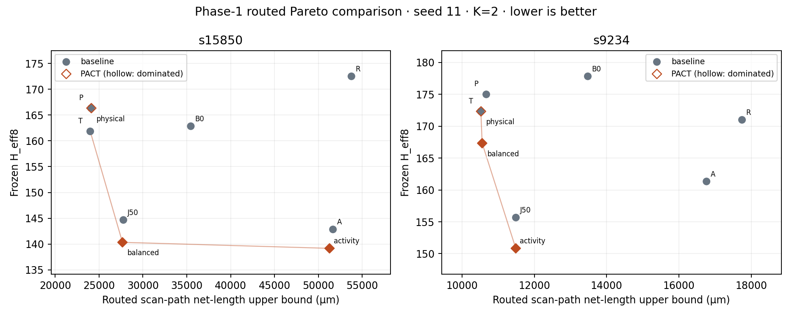

# PACT Phase-1 multi-design routed validation

**Classification: `PACT_PHASE1_MULTI_DESIGN_ROUTED_VALIDATION_CONFIRMED`**

On both designs, baseline T and the PACT balanced/activity extremes form the routed front. Both PACT physical extremes are dominated by T: lower proxy cost did not guarantee a lower routed cost.

Yes, under this frozen seed-11/K=2 Nangate45 experiment, joint physical/activity Pareto advantages survive on both new designs with test quality preserved.

The frozen experiment uses seed 11, K=2 and the unchanged Optimizer-v2.3 archives. Six candidates (three per design) were preselected using only authoritative proxy/H_eff8 objectives. All six Phase-0C baseline methods per design are included. No baseline or s5378 route was repeated.

## Contract, selection and provenance

The [experimental contract](reports/phase1_routed_validation/EXPERIMENT_CONTRACT.md), [freeze hashes](reports/phase1_routed_validation/freeze.json), [input hashes](reports/phase1_routed_validation/provenance.json) and [environment](reports/phase1_routed_validation/environment.json) record the pre-route decision. The global exact nondominated union includes all six retained v2.3 archives per design (both budget modes, W=1/2/4). Physical and activity extrema minimize their respective authoritative objectives; the balanced point minimizes squared Euclidean distance to the normalized utopia using global-frontier min/max ranges, with deterministic objective/hash tie breaks. See [selected architectures](reports/phase1_routed_validation/selected_candidates.json) for full hashes and source runs.

Baseline materialization reproduced the historical P ODB hash byte-for-byte for both designs. Archived routed ODB compressed/uncompressed hashes and structural proofs passed. OpenROAD `26Q2-1164-g08f67ee5ec` and ORFS `5e8b1450d19263f797a27c4f371b9dd19f32a3aa` match Phase-0C. New ORFS work and raw route evidence are under `D:/PACT_EXPERIMENTS/results/phase1_routed_validation`; WORK_HOME changes only output placement. Existing configs, SDC, rewiring and verification are reused.

| Design | Role | Architecture SHA256 prefix | Source run |
|---|---|---|---|
| s15850 | physical_extreme | `1b389009b464` | equal_evaluations/w2 |
| s15850 | balanced | `c59deca1ac58` | equal_evaluations/w1 |
| s15850 | activity_extreme | `b11444606013` | equal_evaluations/w4 |
| s9234 | physical_extreme | `364093541627` | equal_evaluations/w2 |
| s9234 | balanced | `42ab942ed206` | equal_wall/w4 |
| s9234 | activity_extreme | `7df0fb60c2a8` | equal_evaluations/w1 |

## Routing and routed Pareto comparison

P = physical; A = activity; B0 = conventional supplied order; J50 = joint heuristic; T = long-edge-risk heuristic; R = fixed randomized reference. Native B1 is K=1 and incompatible. The physical Pareto axis is the existing full scan-path routed net-length **upper bound**, including shared functional branches; it is not exclusive scan wirelength. H_eff8 remains the frozen dimensionless activity proxy, not measured power. Lower is better on both axes.

### s15850

| Architecture | Proxy µm | H_eff8 | Routed path bound µm | Total wire µm | DRC | Pareto |
|---|---:|---:|---:|---:|---:|---|
| B0 | 20052.010 | 162.833 | 35457.690 | 91376 | 0 | False |
| P | 3525.470 | 166.333 | 24095.050 | 79993 | 0 | False |
| A | 37150.390 | 142.833 | 51657.940 | 107638 | 0 | False |
| J50 | 9052.290 | 144.667 | 27774.430 | 83622 | 0 | False |
| T | 3631.530 | 161.833 | 23996.480 | 79891 | 0 | True |
| R | 39182.070 | 172.500 | 53763.495 | 109789 | 0 | False |
| physical_extreme | 3513.570 | 166.333 | 24121.445 | 80066 | 0 | False |
| balanced | 8984.410 | 140.333 | 27667.890 | 83548 | 0 | True |
| activity_extreme | 36740.610 | 139.167 | 51269.130 | 107251 | 0 | True |

PACT survival: **True**. Balanced-point usefulness: **True**. Proxy/routed ordering: 33 concordant, 3 discordant, 0 tied pairs across all valid architectures.
Ordering inversions: P / T, P / physical_extreme, T / physical_extreme.

Within the selected PACT candidates, proxy-order inversions are absent.

- physical_extreme: QUALIFIED; chains [267, 267]; route 163.462 s; dominated by T.
- balanced: QUALIFIED; chains [267, 267]; route 221.435 s; dominated by none.
- activity_extreme: QUALIFIED; chains [267, 267]; route 180.369 s; dominated by none.

### s9234

| Architecture | Proxy µm | H_eff8 | Routed path bound µm | Total wire µm | DRC | Pareto |
|---|---:|---:|---:|---:|---:|---|
| B0 | 6941.555 | 177.833 | 13480.005 | 40206 | 0 | False |
| P | 1807.825 | 175.000 | 10671.180 | 37356 | 0 | False |
| A | 10083.085 | 161.333 | 16764.025 | 43567 | 0 | False |
| J50 | 3069.885 | 155.667 | 11490.195 | 38195 | 0 | False |
| T | 1723.945 | 172.333 | 10520.985 | 37189 | 0 | True |
| R | 10884.635 | 171.000 | 17746.580 | 44509 | 0 | False |
| physical_extreme | 1723.565 | 172.333 | 10526.205 | 37225 | 0 | False |
| balanced | 1773.185 | 167.333 | 10557.545 | 37257 | 0 | True |
| activity_extreme | 3063.805 | 150.833 | 11487.665 | 38145 | 0 | True |

PACT survival: **True**. Balanced-point usefulness: **True**. Proxy/routed ordering: 35 concordant, 1 discordant, 0 tied pairs across all valid architectures.
Ordering inversions: T / physical_extreme.

Within the selected PACT candidates, proxy-order inversions are absent.

- physical_extreme: QUALIFIED; chains [106, 105]; route 106.321 s; dominated by T.
- balanced: QUALIFIED; chains [105, 106]; route 106.556 s; dominated by none.
- activity_extreme: QUALIFIED; chains [106, 105]; route 109.163 s; dominated by none.

The [machine-readable table](reports/phase1_routed_validation/routed_results.json) includes completion, DRC, congestion/overflow, vias, area when reported, setup/hold WNS/TNS and endpoint counts, runtimes, chain lengths, coverage, pattern counts, hashes, proofs and explicitly unavailable fields. **Timing values are global-route timing**, as in the qualified methodology; no detailed-route signoff STA is claimed.

## Test quality

s9234 retains 211 FFs, 156 frozen FAN patterns and 94.14% stuck-at coverage; s15850 retains 534 FFs, 133 patterns and 94.62%. Selected architectures are re-evaluated only to verify stored objective values and exact ATPG PPI load/unload reconstruction. Coverage is inherited under the established full-scan semantics; it is not a new post-route fault simulation. K=2, minimum chain length 8, length difference at most 2, unchanged FF identity/coordinates, SI/SO identity, architecture hashes and every routed scan link through transparent buffers are checked.

## Cross-design interpretation and limitations

The existing s5378 Phase-0D evidence is `PACT_PHASE0D_ROUTED_PARETO_CONFIRMED` ([reference](reports/phase0d/routed_pareto_qualification/ROUTED_PARETO_REPORT.md)); it is earlier optimizer evidence, not a newly routed v2.3 control. Its representative `75ea663523d9` point reduced routed path cost by 5.81% and H_eff8 by 3.95% against P; three optimizer points survived against the four baselines in that prior comparison. The two new designs test replication using the frozen v2.3 candidates. Three ISCAS designs at one selected seed/K and one Nangate45 flow do not establish universal generalization, scaling, seed robustness, signoff test power, capture activity or IR-drop benefit. The path metric can include shared net branches; H_eff8 weights remain frozen before routing.

## Final answer and remaining research question

The predeclared classification is **`PACT_PHASE1_MULTI_DESIGN_ROUTED_VALIDATION_CONFIRMED`**. Both new designs retain at least one routed nondominated PACT improvement/tradeoff with test quality preserved.

The remaining research question is whether these joint physical/activity Pareto advantages replicate across broader design families, physical seeds and implementation conditions while preserving test quality, and whether the frozen activity proxy predicts independently qualified test-mode physical power behavior.

## Future work and git status

Record broader replication and independently qualified detailed-route timing/power validation as future work; no optimizer tuning, new objective, ML, or search change was performed. The starting tree contained uncommitted v2.1/v2.2/v2.3 work, which remains untouched. All frozen experiment files and reused evidence hashes were rechecked after routing. A slow WSL Git status scan was replaced by native Windows Git; future experiment runners should use the native status capture for this checkout. See [git status](reports/phase1_routed_validation/git_status.txt) and the regression log for final validation.

Integrity: 6/6 new routes qualified; 257 reused evidence files and 8 frozen contract files unchanged. Raw experiment storage: 183.0 MiB on D:. Routed front membership is unchanged when roundoff-equivalent activity values are treated as equal.

Full repository regression: **159 passed in 34.28s** ([log](reports/phase1_routed_validation/regression.log)).
