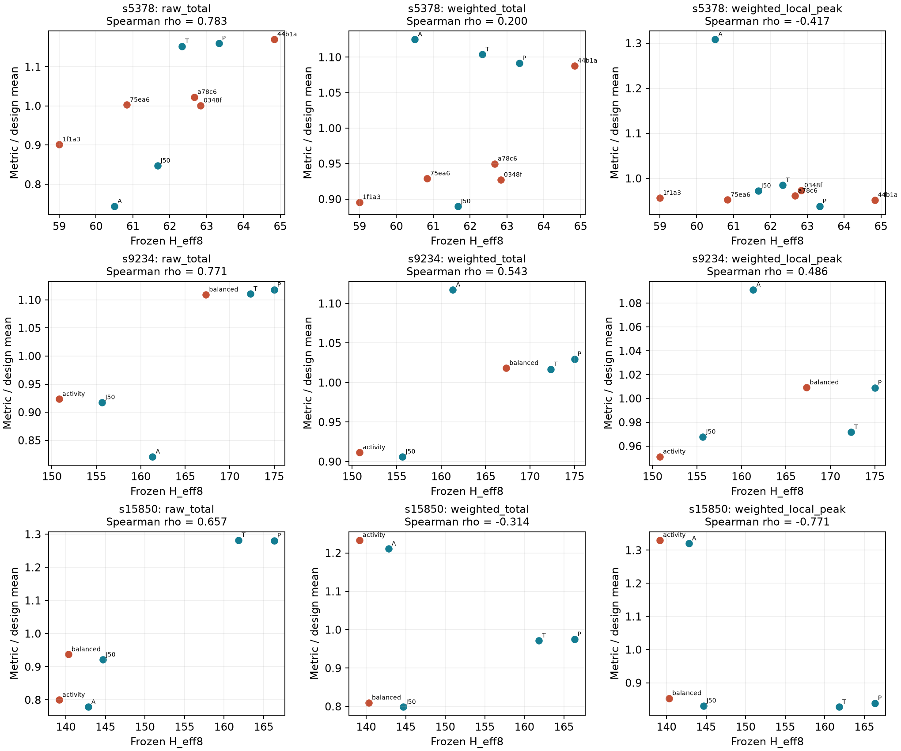

# PACT Phase-2A independent post-route shift-activity validation

**Classification: `PACT_PHASE2A_H_EFF8_ACTIVITY_VALIDATION_PARTIAL`**

**Answer: H_eff8 does not reliably rank the independent physical switching metrics across all three designs.** The association is design- and endpoint-dependent. Lower H_eff8 is not sufficient evidence of lower total routed-wirelength-weighted switching or lower local peak switching. Electrical energy and dynamic power remain unvalidated.

Spearman correlations show where the logical proxy stops tracking the physical surrogate:

| Design | Raw transition total | Routed-weighted total | Routed-weighted local peak |
|---|---:|---:|---:|
| s5378 | 0.783 | 0.200 | -0.417 |
| s9234 | 0.771 | 0.543 | 0.486 |
| s15850 | 0.657 | -0.314 | -0.771 |

H_eff8 predicts the expected direction in **5/10** preregistered pairs for weighted total and **5/10** for weighted local peak. For example, s9234 balanced lowers H_eff8 relative to T but raises both weighted total and local peak. On s15850, activity_extreme lowers H_eff8 relative to A while raw transitions, weighted total, cycle peak and local peak all rise. These counterexamples remain in the result.

## Validation question and frozen evidence

> Across the frozen s5378, s9234 and s15850 architectures, does H_eff8 correctly rank or track independently reconstructed and physically weighted post-route scan-shift switching behavior?

The [contract](reports/phase2a_shift_activity/EXPERIMENT_CONTRACT.md) was hash-frozen before measurement. [Architecture set](reports/phase2a_shift_activity/architecture_set.json), [freeze](reports/phase2a_shift_activity/freeze.json) and [input provenance](reports/phase2a_shift_activity/provenance.json) identify all inputs. Seed 11 and K=2 are fixed. No optimization, new candidates, ATPG generation, placement or routing was run. All four requested baselines and Phase-1 balanced/activity extrema are retained on s9234/s15850. s5378 uses every one of the five previously routed Phase-0D candidates, including dominated candidates, with their original hashes; these are older optimizer evidence, not v2.3 role selections.

| Design | FFs | Patterns | Frozen stuck-at coverage | Clocks / architecture |
|---|---:|---:|---:|---:|
| s15850 | 534 | 133 | 94.62% | 35511 |
| s5378 | 179 | 117 | 96.04% | 10530 |
| s9234 | 211 | 156 | 94.14% | 16536 |

## Independent reconstruction and correctness

All 21 architectures pass canonical hash, FF inventory/coordinate, chain legality, SI/SO identity and fresh routed scan-connectivity checks. Every pattern is replayed with the established FAN parser, PPI bijection and parallel_schedule. A separate cycle recorder is checked against verify_parallel_schedule for final PPI state and every scan-out sample, including pad tails. Archived raw transition totals and peaks also match exactly; those archived scores are used only as a post-computation integrity check.

Initial state is zero. Short chains receive leading zero pad bits while every FF still clocks. Loaded state carries across pattern boundaries. There is no modeled capture and no extra final unload. Thus these are exact stable-state transitions for the frozen **carry-loaded/no-capture** sequence, not a simulated tester load/capture/unload waveform. Scan-link transitions are source-Q changes through verified transparent paths; glitches and timing are not inferred.

[Reconstruction results](reports/phase2a_shift_activity/shift_reconstruction.json) record per-pattern transitions, boundaries, lengths, padding, FF transition totals, state-trace hashes and D: trace locations. Compressed traces retain every cycle’s FF state, FF toggle mask, SI inputs and raw/weighted counts. Coverage is inherited from the frozen full-scan qualification, not new post-route fault simulation.

## Physical weighting and actual functional fanout

No SPEF was found under the existing Phase-1 or ORFS Nangate45 result trees. All selected ODBs expose the parasitic APIs but contain zero CapNodes and zero RSegs on the traced nets. Therefore qualified capacitance is unavailable. Metric B is **routed-wirelength-weighted stable-state switching**, in **µm-transitions**, computed as sum over cycles and FFs of toggle × actual driven wire length.

For each Q/QN source, the extractor follows actual BUF/CLKBUF/INV connectivity, includes complete routed nets with their functional and scan sinks, and counts each unique net once. It stops at other logic. All selected FF outputs are Q; no connected QN output occurs. Shared routed branches are included once, not multiplied by sink count. Inverters preserve stable transition counts. This differs from summing Q-to-SI distances or the existing per-link path bound.

| Design | Internal scan SI sinks | Nets with scan + other sinks | Other sink terminals | Transparent branches |
|---|---:|---:|---:|---:|
| s5378 | 177 | 177 | 1038 | 191 |
| s9234 | 209 | 209 | 1392 | 143 |
| s15850 | 532 | 532 | 2028 | 217 |

Counts above are constant within each design in this set. “Other sinks” include functional inputs and transparent-gate inputs. All internal scan nets share non-scan sinks. [Physical audit](reports/phase2a_shift_activity/physical_weighting.json) links hashed per-net inventories. Pin capacitance, layer-dependent capacitance, via capacitance, coupling, cell internal energy, clock/SE/PI/input-port switching and nontransparent combinational switching are excluded. Wirelength is a geometric load surrogate, not measured capacitance, energy, or power.

## Architecture measurements and spatial peaks

Spatial measurement uses fixed 10×10 bins over the frozen die outline, with routed FF origins. Per-cycle bin sums use raw toggles or independently extracted wire weights. Local peak is the largest equal-weight sum in any wholly contained 2×2-bin window over all shift cycles. No H_eff8 kernel, direct-sink weights or objective score enters measurement. Load is assigned to the driver bin; this is not a map of distributed wire dissipation. No occupancy normalization is applied.

### s5378

| Architecture | H_eff8 | Raw total | Raw peak | Weighted total (µm-transitions) | Weighted cycle peak | Raw local peak | Weighted local peak |
|---|---:|---:|---:|---:|---:|---:|---:|
| P | 63.333 | 941,901 | 108 | 38,871,710.135 | 4,718.760 | 19 | 901.170 |
| A | 60.500 | 604,035 | 92 | 40,063,920.425 | 6,379.120 | 17 | 1,257.040 |
| J50 | 61.667 | 688,291 | 93 | 31,686,402.555 | 4,487.570 | 18 | 934.350 |
| T | 62.333 | 935,989 | 109 | 39,310,031.840 | 4,675.055 | 20 | 946.295 |
| 44b1a2ab5a1e | 64.833 | 950,055 | 112 | 38,741,008.785 | 4,803.130 | 19 | 914.685 |
| 0348f2cc6b9d | 62.833 | 813,027 | 104 | 33,019,545.585 | 4,409.115 | 18 | 934.970 |
| a78c6ce1a5a1 | 62.667 | 830,749 | 102 | 33,822,718.915 | 4,424.695 | 17 | 923.750 |
| 75ea663523d9 | 60.833 | 814,383 | 99 | 33,085,269.345 | 4,309.110 | 17 | 914.970 |
| 1f1a3a458946 | 59.000 | 732,237 | 102 | 31,897,490.565 | 4,665.190 | 18 | 919.080 |

### s9234

| Architecture | H_eff8 | Raw total | Raw peak | Weighted total (µm-transitions) | Weighted cycle peak | Raw local peak | Weighted local peak |
|---|---:|---:|---:|---:|---:|---:|---:|
| P | 175.000 | 1,720,633 | 127 | 104,297,716.715 | 8,361.880 | 23 | 1,987.015 |
| A | 161.333 | 1,263,283 | 105 | 113,167,447.160 | 9,965.995 | 21 | 2,148.880 |
| J50 | 155.667 | 1,412,163 | 111 | 91,778,916.965 | 8,603.130 | 21 | 1,905.805 |
| T | 172.333 | 1,709,633 | 126 | 102,975,754.955 | 8,350.035 | 24 | 1,913.550 |
| balanced | 167.333 | 1,707,345 | 123 | 103,127,337.950 | 8,319.950 | 23 | 1,987.320 |
| activity_extreme | 150.833 | 1,420,983 | 113 | 92,326,041.365 | 8,500.035 | 21 | 1,873.025 |

### s15850

| Architecture | H_eff8 | Raw total | Raw peak | Weighted total (µm-transitions) | Weighted cycle peak | Raw local peak | Weighted local peak |
|---|---:|---:|---:|---:|---:|---:|---:|
| P | 166.333 | 9,013,282 | 299 | 445,725,109.210 | 15,916.305 | 43 | 2,339.440 |
| A | 142.833 | 5,477,504 | 245 | 553,470,255.815 | 25,433.290 | 35 | 3,682.970 |
| J50 | 144.667 | 6,481,362 | 262 | 364,972,759.290 | 15,448.680 | 38 | 2,317.410 |
| T | 161.833 | 9,022,108 | 291 | 443,964,917.075 | 15,238.830 | 39 | 2,306.780 |
| balanced | 140.333 | 6,594,268 | 259 | 370,086,138.785 | 15,418.060 | 37 | 2,380.250 |
| activity_extreme | 139.167 | 5,627,422 | 250 | 563,730,538.220 | 25,680.630 | 36 | 3,711.730 |

Mean/p95 cycle activity, single-bin peaks, cumulative spatial maps and exact peak cycle/window locations are in [activity_metrics.json](reports/phase2a_shift_activity/activity_metrics.json).

## Correlations and exact rankings

Positive correlation means lower H_eff8 tracks lower measured activity. Rank ties use average ranks and Kendall tau-b; H_eff8 is rounded to nine decimals only for roundoff ties. Pearson is secondary. Spearman p-values enumerate all architecture-label permutations, two-sided, and are descriptive: these selected architectures are not random independent samples, and multiple endpoints are inspected. No statistical significance or generalization claim is made.

| Design | Endpoint | Spearman ρ | Kendall τ-b | Pearson r | Exact descriptive p |
|---|---|---:|---:|---:|---:|
| s5378 (n=9) | raw_total | 0.783 | 0.611 | 0.726 | 0.017 |
| s5378 (n=9) | raw_peak | 0.745 | 0.592 | 0.652 | 0.026 |
| s5378 (n=9) | weighted_total | 0.200 | 0.111 | 0.407 | 0.613 |
| s5378 (n=9) | weighted_peak | 0.117 | 0.111 | -0.231 | 0.776 |
| s5378 (n=9) | raw_bin_peak | NA | NA | NA | NA |
| s5378 (n=9) | raw_local_peak | 0.511 | 0.402 | 0.470 | 0.164 |
| s5378 (n=9) | weighted_bin_peak | -0.733 | -0.556 | -0.502 | 0.031 |
| s5378 (n=9) | weighted_local_peak | -0.417 | -0.278 | -0.336 | 0.270 |
| s9234 (n=6) | raw_total | 0.771 | 0.600 | 0.778 | 0.103 |
| s9234 (n=6) | raw_peak | 0.771 | 0.600 | 0.790 | 0.103 |
| s9234 (n=6) | weighted_total | 0.543 | 0.333 | 0.570 | 0.297 |
| s9234 (n=6) | weighted_peak | -0.543 | -0.200 | -0.260 | 0.297 |
| s9234 (n=6) | raw_bin_peak | 0.131 | 0.115 | 0.125 | 1.000 |
| s9234 (n=6) | raw_local_peak | 0.833 | 0.701 | 0.878 | 0.067 |
| s9234 (n=6) | weighted_bin_peak | -0.029 | 0.067 | -0.116 | 1.000 |
| s9234 (n=6) | weighted_local_peak | 0.486 | 0.333 | 0.235 | 0.356 |
| s15850 (n=6) | raw_total | 0.657 | 0.467 | 0.951 | 0.175 |
| s15850 (n=6) | raw_peak | 0.829 | 0.733 | 0.962 | 0.058 |
| s15850 (n=6) | weighted_total | -0.314 | -0.200 | -0.169 | 0.564 |
| s15850 (n=6) | weighted_peak | -0.429 | -0.333 | -0.525 | 0.419 |
| s15850 (n=6) | raw_bin_peak | 0.837 | 0.745 | 0.877 | 0.067 |
| s15850 (n=6) | raw_local_peak | 0.829 | 0.733 | 0.879 | 0.058 |
| s15850 (n=6) | weighted_bin_peak | -0.657 | -0.467 | -0.586 | 0.175 |
| s15850 (n=6) | weighted_local_peak | -0.771 | -0.600 | -0.555 | 0.103 |

Exact ascending rankings (values retained to identify ties):

- **s5378 H_eff8:** 1f1a3a458946 (59.000) → A (60.500) → 75ea663523d9 (60.833) → J50 (61.667) → T (62.333) → a78c6ce1a5a1 (62.667) → 0348f2cc6b9d (62.833) → P (63.333) → 44b1a2ab5a1e (64.833)
- **s5378 raw_total:** A (604035.000) → J50 (688291.000) → 1f1a3a458946 (732237.000) → 0348f2cc6b9d (813027.000) → 75ea663523d9 (814383.000) → a78c6ce1a5a1 (830749.000) → T (935989.000) → P (941901.000) → 44b1a2ab5a1e (950055.000)
- **s5378 raw_peak:** A (92.000) → J50 (93.000) → 75ea663523d9 (99.000) → 1f1a3a458946 (102.000) → a78c6ce1a5a1 (102.000) → 0348f2cc6b9d (104.000) → P (108.000) → T (109.000) → 44b1a2ab5a1e (112.000)
- **s5378 weighted_total:** J50 (31686402.555) → 1f1a3a458946 (31897490.565) → 0348f2cc6b9d (33019545.585) → 75ea663523d9 (33085269.345) → a78c6ce1a5a1 (33822718.915) → 44b1a2ab5a1e (38741008.785) → P (38871710.135) → T (39310031.840) → A (40063920.425)
- **s5378 weighted_peak:** 75ea663523d9 (4309.110) → 0348f2cc6b9d (4409.115) → a78c6ce1a5a1 (4424.695) → J50 (4487.570) → 1f1a3a458946 (4665.190) → T (4675.055) → P (4718.760) → 44b1a2ab5a1e (4803.130) → A (6379.120)
- **s5378 raw_bin_peak:** 0348f2cc6b9d (7.000) → 1f1a3a458946 (7.000) → 44b1a2ab5a1e (7.000) → 75ea663523d9 (7.000) → A (7.000) → J50 (7.000) → P (7.000) → T (7.000) → a78c6ce1a5a1 (7.000)
- **s5378 raw_local_peak:** 75ea663523d9 (17.000) → A (17.000) → a78c6ce1a5a1 (17.000) → 0348f2cc6b9d (18.000) → 1f1a3a458946 (18.000) → J50 (18.000) → 44b1a2ab5a1e (19.000) → P (19.000) → T (20.000)
- **s5378 weighted_bin_peak:** 44b1a2ab5a1e (422.545) → T (429.625) → P (435.320) → a78c6ce1a5a1 (435.580) → 75ea663523d9 (436.800) → 0348f2cc6b9d (438.640) → 1f1a3a458946 (462.730) → J50 (492.190) → A (595.360)
- **s5378 weighted_local_peak:** P (901.170) → 44b1a2ab5a1e (914.685) → 75ea663523d9 (914.970) → 1f1a3a458946 (919.080) → a78c6ce1a5a1 (923.750) → J50 (934.350) → 0348f2cc6b9d (934.970) → T (946.295) → A (1257.040)
- **s9234 H_eff8:** activity_extreme (150.833) → J50 (155.667) → A (161.333) → balanced (167.333) → T (172.333) → P (175.000)
- **s9234 raw_total:** A (1263283.000) → J50 (1412163.000) → activity_extreme (1420983.000) → balanced (1707345.000) → T (1709633.000) → P (1720633.000)
- **s9234 raw_peak:** A (105.000) → J50 (111.000) → activity_extreme (113.000) → balanced (123.000) → T (126.000) → P (127.000)
- **s9234 weighted_total:** J50 (91778916.965) → activity_extreme (92326041.365) → T (102975754.955) → balanced (103127337.950) → P (104297716.715) → A (113167447.160)
- **s9234 weighted_peak:** balanced (8319.950) → T (8350.035) → P (8361.880) → activity_extreme (8500.035) → J50 (8603.130) → A (9965.995)
- **s9234 raw_bin_peak:** A (9.000) → J50 (10.000) → P (10.000) → T (10.000) → activity_extreme (10.000) → balanced (10.000)
- **s9234 raw_local_peak:** A (21.000) → J50 (21.000) → activity_extreme (21.000) → P (23.000) → balanced (23.000) → T (24.000)
- **s9234 weighted_bin_peak:** P (768.590) → activity_extreme (779.575) → J50 (787.475) → balanced (797.230) → T (799.150) → A (967.530)
- **s9234 weighted_local_peak:** activity_extreme (1873.025) → J50 (1905.805) → T (1913.550) → P (1987.015) → balanced (1987.320) → A (2148.880)
- **s15850 H_eff8:** activity_extreme (139.167) → balanced (140.333) → A (142.833) → J50 (144.667) → T (161.833) → P (166.333)
- **s15850 raw_total:** A (5477504.000) → activity_extreme (5627422.000) → J50 (6481362.000) → balanced (6594268.000) → P (9013282.000) → T (9022108.000)
- **s15850 raw_peak:** A (245.000) → activity_extreme (250.000) → balanced (259.000) → J50 (262.000) → T (291.000) → P (299.000)
- **s15850 weighted_total:** J50 (364972759.290) → balanced (370086138.785) → T (443964917.075) → P (445725109.210) → A (553470255.815) → activity_extreme (563730538.220)
- **s15850 weighted_peak:** T (15238.830) → balanced (15418.060) → J50 (15448.680) → P (15916.305) → A (25433.290) → activity_extreme (25680.630)
- **s15850 raw_bin_peak:** A (14.000) → activity_extreme (14.000) → J50 (15.000) → balanced (15.000) → P (16.000) → T (16.000)
- **s15850 raw_local_peak:** A (35.000) → activity_extreme (36.000) → balanced (37.000) → J50 (38.000) → T (39.000) → P (43.000)
- **s15850 weighted_bin_peak:** T (1130.270) → P (1133.035) → balanced (1152.715) → J50 (1177.600) → activity_extreme (1593.440) → A (1596.445)
- **s15850 weighted_local_peak:** T (2306.780) → J50 (2317.410) → P (2339.440) → balanced (2380.250) → A (3682.970) → activity_extreme (3711.730)

Pooled results divide each metric and H_eff8 by its own design mean before pooling. Each design has total weight one (each architecture weight 1/n_design); weighted midranks and weighted pair counts preserve equal design weight. Fractional within-design ranks are a second scale-free descriptive analysis. No raw quantities or pooled p-values are used.

| Endpoint | Mean-normalized pooled ρ | Pooled τ-b | Pooled Pearson | Within-design rank pooled ρ |
|---|---:|---:|---:|---:|
| raw_total | 0.771 | 0.570 | 0.843 | 0.739 |
| raw_peak | 0.764 | 0.581 | 0.821 | 0.783 |
| weighted_total | 0.181 | 0.051 | 0.057 | 0.172 |
| weighted_peak | -0.370 | -0.240 | -0.416 | -0.290 |
| raw_bin_peak | 0.507 | 0.427 | 0.597 | 0.408 |
| raw_local_peak | 0.702 | 0.511 | 0.783 | 0.692 |
| weighted_bin_peak | -0.424 | -0.287 | -0.443 | -0.464 |
| weighted_local_peak | -0.188 | -0.150 | -0.397 | -0.232 |

## Preregistered PACT/baseline comparisons

Every delta below is PACT minus baseline; negative means a reduction. Direction columns compare the sign of each activity delta with the H_eff8 delta, with ties reported explicitly.

| Design / baseline → PACT | ΔH_eff8 | Δraw total | Δweighted total | Δweighted cycle peak | Δweighted local peak | Direction raw / weighted total / cycle / local |
|---|---:|---:|---:|---:|---:|---|
| s5378 P → 75ea663523d9 | -2.500 | -127,518 | -5,786,440.790 | -409.650 | +13.800 | correct / correct / correct / incorrect |
| s5378 T → 75ea663523d9 | -1.500 | -121,606 | -6,224,762.495 | -365.945 | -31.325 | correct / correct / correct / correct |
| s5378 J50 → 1f1a3a458946 | -2.667 | +43,946 | +211,088.010 | +177.620 | -15.270 | incorrect / incorrect / incorrect / correct |
| s5378 A → 1f1a3a458946 | -1.500 | +128,202 | -8,166,429.860 | -1,713.930 | -337.960 | incorrect / correct / correct / correct |
| s9234 T → balanced | -5.000 | -2,288 | +151,582.995 | -30.085 | +73.770 | correct / incorrect / correct / incorrect |
| s9234 J50 → activity_extreme | -4.833 | +8,820 | +547,124.400 | -103.095 | -32.780 | incorrect / incorrect / correct / correct |
| s9234 A → activity_extreme | -10.500 | +157,700 | -20,841,405.795 | -1,465.960 | -275.855 | incorrect / correct / correct / correct |
| s15850 T → balanced | -21.500 | -2,427,840 | -73,878,778.290 | +179.230 | +73.470 | correct / correct / incorrect / incorrect |
| s15850 J50 → balanced | -4.333 | +112,906 | +5,113,379.495 | -30.620 | +62.840 | incorrect / incorrect / correct / incorrect |
| s15850 A → activity_extreme | -3.667 | +149,918 | +10,260,282.405 | +247.340 | +28.760 | incorrect / incorrect / incorrect / incorrect |

[correlation.json](reports/phase2a_shift_activity/correlation.json) additionally includes percentage differences and all raw/bin/local endpoints for every pair.

## Interpretation, limitations and classification

The preregistered strong-confirmation rule requires ρ≥0.7 for weighted total and weighted local peak in every design plus correct directions for both endpoints in every specified pair. It is not met. The failure rule requires nonpositive correlations for both physical endpoints in every design. Otherwise the contract classifies the result as partial/design-dependent, rather than hiding negative endpoints.

Final classification: **`PACT_PHASE2A_H_EFF8_ACTIVITY_VALIDATION_PARTIAL`**. The physical-energy portion is **INCOMPLETE**. The partial label is not a claim that H_eff8 is physically validated. See endpoint and pairwise signs above.

These three ISCAS designs, one seed, fixed K and selected existing architectures cannot establish general behavior. The metrics share frozen patterns and chain semantics with H_eff8 because those define the experiment; independence concerns the measurement calculation and physical weights. Raw total is a logical companion metric already present in earlier reports, not new electrical evidence. The new routed weighting and 10×10/2×2 spatial measurement use neither H_eff8 internals nor a monotonic transform. Single peak values may be driven by one cycle or boundary; peak witnesses and full traces are retained.

To establish electrical behavior requires qualified detailed-route RC extraction (or validated SPEF) for these exact ODB hashes, compatible timing/library and pin-capacitance data, defined coupling treatment and voltage, and independently validated test-mode activity including capture/unload, clocks and relevant combinational transitions. A qualified power analysis is required before a post-route dynamic test-power claim. No signoff flow was built in this task.

**Next research question:** With these architectures still frozen, does qualified capacitance-weighted activity under a validated capture/load/unload waveform preserve or reverse the observed endpoint-dependent rankings?

## Reproduction and validation

Implementation: `scripts/phase2a_freeze.py` (one-time freeze), `openroad -python -no_init -exit scripts/phase2a_extract_odb.py`, `scripts/phase2a_validate.py measure`, and `scripts/phase2a_validate.py report`. Use the existing WSL `/root/pact-deps/pact-venv/bin/python` and repository `src` on PYTHONPATH. The freeze command refuses replacement. Raw evidence and traces are under `D:/PACT_EXPERIMENTS/results/phase2a_shift_activity`; compact reports remain here.

- [focused_tests.log](reports/phase2a_shift_activity/focused_tests.log): 22 passed in 4.75s
- [regression.log](reports/phase2a_shift_activity/regression.log): 163 passed in 138.55s (0:02:18)

All frozen evidence is rehashed after measurement. Prior optimizer changes remain untouched.

Final audit: all 148 frozen input files, four frozen contract files, and 45 measurement artifact/code hashes were rechecked. Raw net inventories and cycle traces occupy 44.88 MiB on D:. See [integrity audit](reports/phase2a_shift_activity/integrity_audit.json).

Regression setup notes: the initial WSL mounted-drive file-descriptor capture error and subsequent missing-threadpoolctl collection error occurred before tests ran. Their logs are retained as [capture error](reports/phase2a_shift_activity/regression_capture_error.log) and [missing dependency](reports/phase2a_shift_activity/regression_missing_dependency.log). The successful full run uses in-memory output capture and threadpoolctl from the D: experiment cache. [Environment and exact command](reports/phase2a_shift_activity/environment.json) record the setup. Run `scripts/phase2a_finalize.py` after `report` to reproduce this final presentation and audit.
