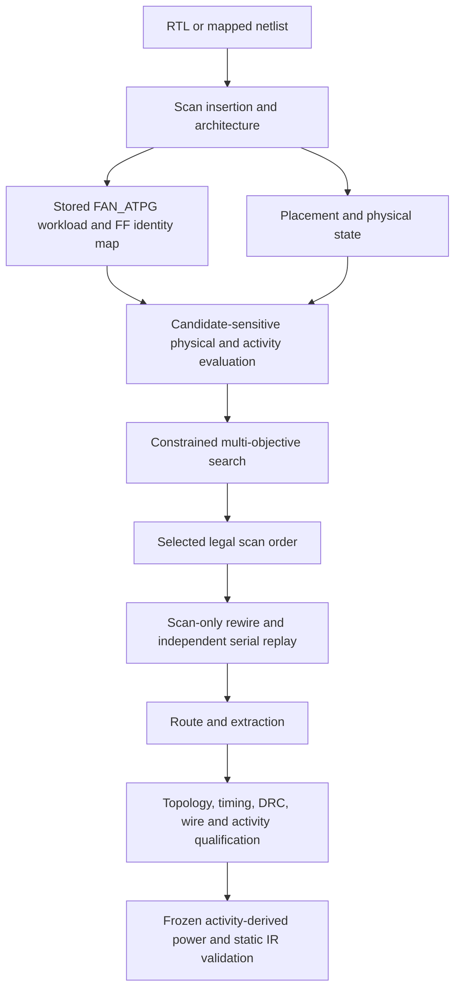

# PACT — Physical and ATPG-aware Co-optimization of Test Architectures

PACT searches legal scan-chain architectures using placed flip-flop geometry and stored ATPG load/response workloads, then checks selected orders through independent replay and physical implementation. Conventional logical ordering can place successive scan flip-flops far apart; shortening those connections also redistributes switching on shared functional nets. PACT keeps scan wire, total switching and spatial activity peaks separate, preserves test/topology constraints and measures whether predicted improvements survive routing and extraction.

**Current conclusion:** frozen designs show mixed wire/activity tradeoffs. The latest power-integrity validation found **no registered material static IR-drop benefit**; thermal impact was not evaluated. Algorithm development is frozen under that tested basis. See [negative results](docs/experiments/negative_results.md) and [complete Gate 10A evidence](reports/gate10a/report.md).

## Motivation and flow

ATPG defines the shifted workload. Placement determines distances and shared-net loads. A legal permutation can improve a predictor while changing routed capacitance and the location of the decisive activity peak. Logical correctness, proxy gains, implemented gains and practical physical impact therefore need separate checks.



The numerical CLI is the maintained M3/M5 solver. Candidate-stateful and registered benchmark campaigns use their own scripts/frozen inputs. [Architecture](docs/architecture/overview.md) explains those interfaces.

## Metrics

| Quantity | Definition |
|---|---|
| `K` | Scan-chain count; FF membership, capacities, clock domains and fixed endpoints constrain legal orders |
| Scan HPWL / `W_proxy` | Port-inclusive Manhattan scan-wire predictor |
| Routed scan WL | Connected scan-path net-length upper bound, including functional branches on shared nets |
| `E` | Sum of ground-plus-pin capacitance times data transitions, in fF·transitions |
| `H4`, `H8` | Maximum cycle/bin activity on source-localized 4×4 and 8×8 grids |
| `epsilon` | Relative wire allowance: `W_proxy ≤ (1 + epsilon) × W_proxy(reference)` |
| Timing / DRC | Recorded timing availability/slack and detailed-route violations used as qualification gates |

[Objective definitions](docs/methodology/objectives.md) distinguish schedules, prediction and measured metrics. Switching proxies alone do not measure watts, temperature or transient droop.

## Scientific status

| Evidence | Demonstrated scope |
|---|---|
| Numerical contracts | Exact incremental/reference equality, rollback, legal topology and independent serial replay |
| Stage A | 19/19 selected records and 27/30 indexed architectures qualified on the common backend |
| Stage B | Nine routed selections across s5378, s9234 and s15850 passed registered wire budgets; some proxy gains did not transfer |
| End-to-end gate | Frozen references and nine selected orders passed physical, serial and collapsed FAN fault-class identity/weight checks |
| Gate 09 | Mixed b14/b15 tradeoffs; b17 ATPG timed out at its fixed limit; b18 was deferred |
| Gate 10A | Nine frozen architectures qualified; primary worst-static-drop gains of 3 µV and 8 µV missed the registered material threshold |

These are saved measurements. [Canonical reproduction](docs/reproduction/canonical_results.md) links the exact tables, protocols and receipts. Limits include bounded logic coverage, candidate capacitance error, restricted workloads/placements, individual uncollapsed fault members not enumerated and transient/thermal effects not qualified. No learned model is implemented.

## Installation and quick start

Python 3.11+ is required. From a fresh checkout:

```sh
python -m venv .venv
# Linux/WSL: source .venv/bin/activate
# PowerShell: .venv/Scripts/Activate.ps1
python -m pip install -e '.[optimizer,dev]'
pact-optimize --synthetic 64 --chains 2 --time-budget 1 --output scratch/example
pact validate-scan --architecture scratch/example/optimized.architecture.json
```

Choose a fresh output directory. This completes a numerical architecture search and topology check; it is not benchmark evidence. OpenROAD and FAN_ATPG are unnecessary for it. The full campaign/test harness targets Linux/WSL:

```sh
PYTHONPATH=src:scripts:. python -m pytest -q
python scripts/verify_reproducibility.py
```

The verifier checks retained hashes and independently replays 18 stored Stage-B architectures without EDA or new search. [Environment](docs/reproduction/environment.md) describes Python packages, compilers and exact tool pins. Physical reruns additionally need frozen ODB/SDC, technology/library inputs, qualified OpenROAD/ORFS, FAN_ATPG and simulator builds.

## Repository map

| Path | Purpose |
|---|---|
| `src/pact/`, `scripts/`, `tests/` | Models, CLIs, adapters, registered campaign tools and regressions |
| `config/`, `experiments/`, `benchmarks/` | Schemas, settings, benchmark identities and frozen protocols |
| `examples/`, `artifacts/` | Small usage examples and required placed/workload fixtures |
| `results/`, `reports/` | Compact canonical comparisons, architectures, qualification and provenance |
| `docs/architecture/`, `docs/methodology/` | Implementation and objective/model/search definitions |
| `docs/reproduction/`, `docs/experiments/` | Reproduction, history and negative findings |
| `patches/upstream/` | Preserved tool repairs and source provenance |
| `archives/`, `cleanup/` | External-archive index, verified storage actions and retention records |

Established source paths remain stable. Start with [usage](docs/usage.md), [troubleshooting](docs/troubleshooting.md) and [contributing](CONTRIBUTING.md). Historical gates belong in [experiment history](docs/experiments/history.md).

## Upstream work, citation and license

PACT required explicit OpenROAD endpoint/metadata, OpenSTA alias and FAN construction/reporting repairs. [Upstream provenance](docs/upstream.md) records scope, revisions, patches and discussions; local qualification does not imply an upstream merge.

Use [CITATION.cff](CITATION.cff) and cite the exact software revision, workload and experiment export. No publication DOI is declared. PACT code is [MIT licensed](LICENSE); external tools, libraries, PDKs and benchmarks retain their own licensing and attribution.
