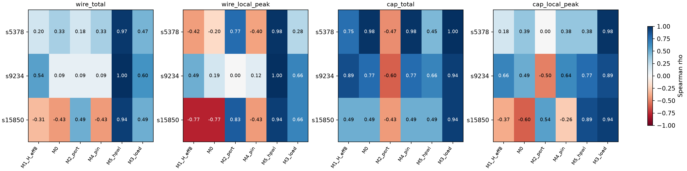

# PACT Phase-2B — Physical Activity Model Qualification

**Classification: `PACT_PHASE2B_SURROGATE_PARTIAL`.**

The best inexpensive metric depends on the physical reference. M5 owned-net placement HPWL passes the preregistered geometric gate on every design. M3 input pin capacitance plus a fixed technology wire-capacitance estimate passes the capacitance-load gate on every design. No one family passes both gates, so the overall result is PARTIAL. These gates describe 21 selected frozen architectures, not universal validation.

**Capacitance extraction succeeded for all 21 routes. Electrical energy/power validation remains INCOMPLETE.** The experiment measures stable-state load-transition counts. No optimizer integration, search, new candidate selection, routing, placement or ATPG generation was performed.

## Frozen scope and reference qualification

All nine s5378 architectures (P/A/J50/T and all five Phase-0D candidates) and all six each for s9234/s15850 (P/A/J50/T/balanced/activity_extreme) are retained. Seed 11 and K=2 remain fixed. The [contract](EXPERIMENT_CONTRACT.md), [freeze](freeze.json), [architecture set](architecture_set.json) and [provenance](provenance.json) identify the inputs. Every one of 649 frozen input files was rehashed after execution.

The Phase-2A classification remains `PACT_PHASE2A_H_EFF8_ACTIVITY_VALIDATION_PARTIAL`; its geometric correlations and counterexamples are unchanged. New electrical load evidence does not retroactively qualify Phase-2A energy or reinterpret its µm-transition results.

OpenROAD `26Q2-1164-g08f67ee5ec` / OpenRCX extracted copies of the exact decompressed 5_2_route ODBs with the installed Nangate45 rules, model index 0, corner X. The binary uses `extract_parasitics -ext_model_file`; newer ORFS source suggested an unavailable `set_extraction_rules_file` command. Failed API probe logs are retained. No ORFS finish or obstruction deletion was run. [extraction_audit.json](extraction_audit.json) records every command, version, warning, input/output hash, net/resistor/capacitor count and total capacitance.

The primary electrical load convention is **C_eff = extracted ground capacitance + 1× incident coupling capacitance + input pin capacitance**. Wire geometry and vias are handled by the OpenRCX model; there is no invented separate via-capacitance constant. Coupling below 0.1 fF is grounded by OpenRCX. Explicit coupling is charged once to each incident net when that net toggles; this is a stated endpoint-load convention, not aggressor-aware coupling energy. Ground-plus-pin results provide a sensitivity check. Output external pin loading is not fabricated. Liberty pin loads use Nangate typical, 1.10 V / 25°C; no voltage-squared conversion is applied.

`A_cap_total` covers the uniquely FF-owned Q/QN net trees through BUF/CLKBUF/INV branches. For these relevant nets stable toggles equal source toggles, so this sum equals `A_ff_cap`. The load contains actual routed buffer/sink input pins. It excludes nontransparent combinational outputs, clock/SE/PI nets, internal cell activity and glitches. A full-circuit all-net electrical target cannot be supplied from these FF-only waveforms. Units are **fF-transitions**, distinct from **µm-transitions** and from energy or power.

## Primary comparison

The primary waveform is exactly Phase-2A: zero initial FF state, states carry between loads, no capture, no final unload. Original total/per-FF counts and both geometric labels reproduce exactly (floating geometric sums within 1e-12 relative tolerance). All primary candidate metrics were recomputed twice with byte-identical JSON.

Spearman rho below uses each total candidate for total targets and its M6 fixed-window local version for local targets. H_eff8 is unchanged.

| Design | Candidate | Wire total | Wire local peak | Cap total | Cap local peak |
|---|---|---:|---:|---:|---:|
| s5378 | M1_H_eff8 | 0.200 | -0.417 | 0.750 | 0.183 |
| s5378 | M0 | 0.333 | -0.199 | 0.983 | 0.390 |
| s5378 | M2_port | 0.183 | 0.767 | -0.467 | 0.000 |
| s5378 | M4_pin | 0.333 | -0.400 | 0.983 | 0.383 |
| s5378 | M5_hpwl | 0.967 | 0.983 | 0.450 | 0.383 |
| s5378 | M3_load | 0.467 | 0.283 | 1.000 | 0.983 |
| s9234 | M1_H_eff8 | 0.543 | 0.486 | 0.886 | 0.657 |
| s9234 | M0 | 0.086 | 0.185 | 0.771 | 0.494 |
| s9234 | M2_port | 0.086 | 0.000 | -0.600 | -0.500 |
| s9234 | M4_pin | 0.086 | 0.116 | 0.771 | 0.638 |
| s9234 | M5_hpwl | 1.000 | 1.000 | 0.657 | 0.771 |
| s9234 | M3_load | 0.600 | 0.657 | 0.943 | 0.886 |
| s15850 | M1_H_eff8 | -0.314 | -0.771 | 0.486 | -0.371 |
| s15850 | M0 | -0.429 | -0.771 | 0.486 | -0.600 |
| s15850 | M2_port | 0.486 | 0.829 | -0.429 | 0.543 |
| s15850 | M4_pin | -0.429 | -0.429 | 0.486 | -0.257 |
| s15850 | M5_hpwl | 0.943 | 0.943 | 0.486 | 0.886 |
| s15850 | M3_load | 0.486 | 0.657 | 0.943 | 0.943 |

M5 = sum FF toggle × sum HPWL of its pre-route driven net trees, including functional sinks, selected SI sinks and fixed SO port. M3 = sum FF toggle × (sum input pin capacitance + **0.103981 fF/µm × HPWL**). The coefficient is the frozen metal3 signal-wire value from platform `setRC.tcl`, not a fitted parameter. Geometry uses cell origins. No routed buffer/topology/length or SPEF feature enters either predictor.

The placed-only graph removes old SI/SO connections before adding each frozen scan order. Existing transparent cells remain; their input loads and separate branch trees are counted once. SO ports contribute geometry and no invented external capacitance. The API rejects post-route stages and unexpected net fields. [feature_availability.json](feature_availability.json) lists every stage; [candidate_metrics.json](candidate_metrics.json) includes every formula and result.

The availability table names the earliest conceptual stage. Actual fanout/master values here come from the frozen placed snapshot, so this experiment makes a placement-time claim for all physical predictors, not a measured synthesis-only claim. See [feature_stage_audit.json](feature_stage_audit.json).

Spatial versions use the frozen die outline, 10×10 bins and all 81 contained 2×2 windows. They assign load to the FF origin and measure stable per-cycle peaks. They do not locate distributed wire dissipation.

All candidate/target Spearman, Kendall tau-b, secondary Pearson and equal-design pooled results are in [correlation.json](correlation.json). [rankings.json](rankings.json) retains exact values and ascending orders; [pairwise_comparisons.json](pairwise_comparisons.json) lists every pair, with predictor/target/both ties distinguished. No p-value or significance claim is used. Selected architectures are not random independent samples.

| Family / endpoint | Mean-normalized pooled rho | Fractional-rank pooled rho | Worst-design rho |
|---|---:|---:|---:|
| M5_hpwl / wire_total | 0.997 | 0.981 | 0.943 |
| M5_hpwl_local / wire_local_peak | 0.984 | 0.971 | 0.943 |
| M3_load / cap_total | 0.983 | 0.958 | 0.943 |
| M3_load_local / cap_local_peak | 0.962 | 0.939 | 0.886 |

Each design receives total weight one. There are no fitted coefficients, per-design coefficients, ML models or leave-one-design-out tuning; the same frozen formulations apply to all designs. This is evidence of consistency within this set, not extrapolation to other technologies, placement seeds, chain counts or large designs.

## Direct answers to the research questions

**1. Why did H_eff8 fail?** It summarizes logical/spatial FF transitions without the actual source-dependent driven-load distribution. A low logical hotspot score can move transitions onto physically longer or more heavily loaded net trees. It neither accounts for each functional-plus-scan tree nor reproduces this experiment’s fixed-window local objective. s15850 preserves the sign reversals for both routed-wire endpoints.

**2. Which physical property explains the largest mismatch?** The evidence points to whole FF-driven tree extent for the geometric mismatch: M5 HPWL reaches rho 0.943–1.000 for geometric totals and 0.943–1.000 for local peaks. Scan-link-only distance, raw toggles and fanout/pin-only alternatives fail to do this across designs. For the electrical-load target, input pin capacitance changes the balance: M3 adds it to estimated wire load and reaches total rho 0.943–1.000 and local rho 0.886–0.983. The component fractions below quantify contributions; this diagnostic does not establish a unique causal variance decomposition.

| Design | Pin share of cap activity, range | Ground-wire share, range | Incident-coupling share, range |
|---|---:|---:|---:|
| s5378 | 58.3–70.1% | 15.7–22.2% | 14.1–19.5% |
| s9234 | 47.0–57.9% | 22.5–28.1% | 19.4–24.9% |
| s15850 | 32.4–51.9% | 26.4–34.0% | 21.7–33.8% |

**3. Does routed-wirelength weighting materially change ranking?** Yes. The raw-total versus wire-total comparisons below include negative s15850 association and many reversed architecture pairs.

**4. Does capacitance weighting change ranking further?** Yes. Capacitance-plus-pin load is a different reference and changes further total/local pair orders. Ground-only versus incident-coupling results also differ, especially s9234; the coupling convention is consequential and must accompany any use of the metric.

| Design | Comparison | rho | Reversed / all non-tied pairs |
|---|---|---:|---:|
| s5378 | cap_ground_local_peak → cap_local_peak | 0.950 | 2/36 |
| s5378 | cap_ground_total → cap_total | 0.983 | 1/36 |
| s5378 | raw_total → wire_total | 0.333 | 11/36 |
| s5378 | wire_local_peak → cap_local_peak | 0.300 | 14/36 |
| s5378 | wire_total → cap_total | 0.467 | 10/36 |
| s9234 | cap_ground_local_peak → cap_local_peak | 0.600 | 4/15 |
| s9234 | cap_ground_total → cap_total | 0.771 | 3/15 |
| s9234 | raw_total → wire_total | 0.086 | 6/15 |
| s9234 | wire_local_peak → cap_local_peak | 0.771 | 3/15 |
| s9234 | wire_total → cap_total | 0.657 | 3/15 |
| s15850 | cap_ground_local_peak → cap_local_peak | 0.886 | 2/15 |
| s15850 | cap_ground_total → cap_total | 0.943 | 1/15 |
| s15850 | raw_total → wire_total | -0.429 | 9/15 |
| s15850 | wire_local_peak → cap_local_peak | 0.829 | 3/15 |
| s15850 | wire_total → cap_total | 0.543 | 4/15 |

**5. Can placement-time information predict the post-route target?** Yes, within the frozen set and specified waveform/reference: the appropriate whole-tree geometric or pin-plus-wire feature consistently improves the relevant endpoint. This does not establish accurate absolute electrical energy.

**6. Which surrogate works best without target leakage?** M5 HPWL is the strongest simple geometric family; M3 pin-plus-estimated-wire load is the preferred electrical-load candidate. M3 is the research recommendation for a future load-aware objective, with M5 retained as a geometric diagnostic. A universal metric independent of target choice has not been qualified.

**7. Does it generalize across all three designs?** M5 passes both geometric endpoints and M3 passes both capacitance-load endpoints on all three. M3 does not pass the geometric gate and M5 does not pass the electrical gate. The joint preregistered outcome is PARTIAL. The separate FF capture/unload sensitivity below supports M3 but does not replace the primary waveform or upgrade the preregistered result.

**8. What is the computational complexity?** Shared graph construction is O(N_instances + N_sinks), sparse per-architecture weights O(N_ff + reachable N_sinks). Given cached per-FF toggle counts, a total is an O(N_ff) dot product. The implemented packed-trace evaluator costs O(N_ff × N_shift_cycles + N_spatial_bins × N_shift_cycles) per total/local pair. N_shift_cycles = N_patterns × longest_chain for the primary waveform. Working memory uses 1,024-cycle chunks, O(1,024 × (N_ff + N_spatial_bins)), plus packed input trace; no dense N_ff² matrix is built. An event-based implementation can update totals/local bins in O(number_of_shift_toggles), but that performance is not measured here.

**9. Is it cheap enough for future large-scale optimization?** Weight construction and cached-count totals are plausible building blocks. Exhaustive waveform recreation and full local-peak scoring per search candidate are not yet demonstrated practical at 100k–1M gates. The supplementary proof recorder retains full states/toggles and is unsuitable at that scale without streaming. Do not extrapolate these small-design timings into a million-gate throughput claim.

**10. Is electrical validation complete?** No. Exact-route RC extraction and a clearly defined FF-source capacitance-load reference are qualified here. Actual energy/dynamic power, time-dependent coupling, clock/PI/SE and full combinational/internal/glitch activity remain INCOMPLETE. This is no longer blocked on obtaining SPEF; it is limited by reference scope and waveform/power analysis.

**11. Should PACT replace H_eff8 now?** Do not install an optimizer replacement in Phase-2B. H_eff8 should not be treated as a physical/electrical switching objective. Retain it as a logical diagnostic; carry M3 load weighting forward as the most defensible electrical-load candidate and M5 as the geometric companion. Further qualification across seeds/designs and scalable waveform evaluation should precede a separately authorized integration decision. The evidence supports continued activity research, not abandonment or automatic Phase-2C.

## Waveform audit and supplementary sensitivity

FAN BASIC_SCAN contains complete binary PI1/PPI/PPO for these patterns; PI2/PO2/SI fields are empty. The upstream STIL writer defines PI1 setup, a capture clock, next load/unload and final unload. An independent Icarus simulation forces each loaded Q, applies PI1 with SE=0, checks D against PPO and PO against PO1, then pulses the actual library FF clock and verifies captured Q after release. All three designs pass. s9234 source uses a different module name, resolved from its netlist.

The existing cell-library `TETRAMAX` functional mode disables SDF xbuf wrappers, including a self-driven SE wrapper that produced unknown captured Q in the default Icarus configuration. The functional mux and sequential UDP remain unchanged. Failed wrapper-probe logs are retained; no frozen library or netlist was edited.

The new recorder checks every SI stream, final loaded state, scan-out sequence and padding tail against the existing independent verifier. Next load starts from the validated captured response. Short chains receive leading zero padding and continue clocking; final unload clocks the longest length with explicit zero SI. This is a qualified **FF-boundary reconstructed protocol**, not an observed timed tester waveform. The full-circuit status remains `FULL_TEST_WAVEFORM_UNQUALIFIED`.

[waveform_audit.json](waveform_audit.json) contains field counts, commands, logs, pattern boundaries and hashes. Supplementary correlations use this separate sequence and its correspondingly rescored reference labels; frozen H_eff8 is not redefined.

| Design | Family | Wire total rho | Wire local rho | Cap total rho | Cap local rho |
|---|---|---:|---:|---:|---:|
| s5378 | M5_hpwl | 0.967 | 0.950 | 0.683 | 0.833 |
| s5378 | M3_load | 0.800 | 0.783 | 0.983 | 0.967 |
| s9234 | M5_hpwl | 1.000 | 0.829 | 1.000 | 0.943 |
| s9234 | M3_load | 1.000 | 0.899 | 1.000 | 0.986 |
| s15850 | M5_hpwl | 1.000 | 0.943 | 1.000 | 0.886 |
| s15850 | M3_load | 1.000 | 0.829 | 1.000 | 0.943 |

## Measured cost and validation

Placed graph export took 0.105–0.212 s/design. Shared construction of all weight vectors took 0.012–0.028 s/architecture. An individual total-plus-local evaluation took 0.026–0.178 s (179–534 FFs; single BLAS thread). Peak measurement-process RSS was 67.4 MiB. These include packed trace decoding and binning, not extraction or graph construction. [complexity.json](complexity.json) contains every metric/architecture timing and dimensions; waveform reconstruction runtime/RSS is separately reported in waveform_audit.json.

- [focused_tests.log](focused_tests.log): 15 passed in 4.71s.
- [regression.log](regression.log): 174 passed in 143.41s (0:02:23).

Tests cover hand-calculated shift/capture/padding/unload behavior, FF counts, fanout, nested Liberty units, HPWL versus shared/star trees, sparse binning, missing SPEF/cap accounting, target-feature rejection, tied statistics, decision gates, determinism and provenance corruption. Old tests were not edited.

## Reproduction and figure index

See [README](README.md) for execution order and [environment.json](environment.json) for exact commands. The initial Git commit and dirty state are recorded; earlier uncommitted work remains untouched. Input, source, raw measurement and compact output hashes are verified in [integrity_audit.json](integrity_audit.json), [measurement_provenance.json](measurement_provenance.json) and [result_provenance.json](result_provenance.json).

- [Geometric totals](surrogate_vs_wireweighted_total.png) and [geometric local peaks](surrogate_vs_wireweighted_local_peak.png).
- [Capacitance totals](surrogate_vs_capweighted_total.png) and [capacitance local peaks](surrogate_vs_capweighted_local_peak.png).
- [s5378](s5378_scatter_rank_atlas.png), [s9234](s9234_scatter_rank_atlas.png), [s15850](s15850_scatter_rank_atlas.png): complete cross-endpoint atlases, normalized scatter with rank insets.

Raw SPEF, ODB copies, traces, testbenches, logs and per-FF weights remain under `D:/PACT_EXPERIMENTS/results/phase2b_activity_model`. The repository contains only compact reports, code, tests and figures. Phase-2B ends here.
