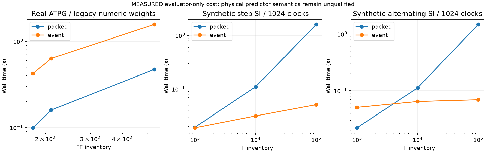
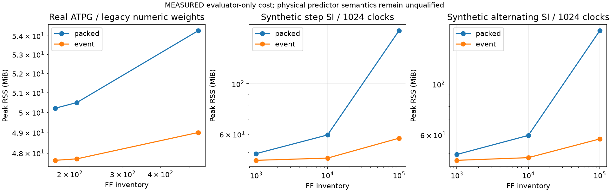
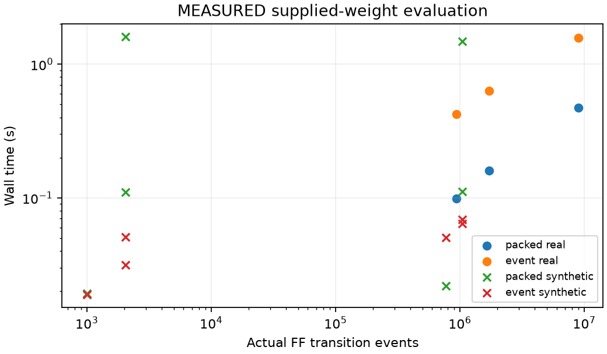

# Phase-2C independent evaluator engineering results

The user requested continuation after the legacy-definition stop. These measurements evaluate numerical code for supplied weights; physical generalization remains withheld pending the definition decision. No predictor, coefficient, target or physical route was changed.

Fresh process per run, three repeats, one BLAS thread. End-to-end includes shift generation plus total/local scoring, excludes common input loading. RSS is absolute whole-process peak including common inputs/imports. Packed generation uses independent chunked state simulation without proof overhead. Real P architectures only; synthetic bounded 1024-cycle streams are separate. The four synthetic patterns in the registration denote four 256-clock stimulus segments, not four complete ATPG loads; pattern_count is null for those cases to avoid implying full-pattern execution.

Synthetic dense means alternating SI, not dense activity throughout all FFs. Zero initial state and a 1024-cycle prefix activate at most 2048 FFs of the two long chains; this is sparse over the full 100k-FF inventory. Real ATPG cases provide the measured dense-activity regime. No complete 100k-FF ATPG load was measured.

**Measured scalability gate: FAIL.** Median real packed/event time ratio is 0.252×. A ratio below 1 means the event evaluator is slower. Median real packed/event RSS ratio is 1.058×.

| Case | FF toggle density | Packed s | Event s | Speedup | Packed MiB | Event MiB | Memory reduction |
|---|---:|---:|---:|---:|---:|---:|---:|
| real:s5378 | 0.4997 | 0.0991 | 0.4213 | 0.235× | 50.21 | 47.65 | 5.1% |
| real:s9234 | 0.4931 | 0.1592 | 0.6323 | 0.252× | 50.50 | 47.72 | 5.5% |
| real:s15850 | 0.4753 | 0.4713 | 1.5661 | 0.301× | 54.28 | 49.00 | 9.7% |
| synthetic:1000:sparse | 0.0010 | 0.0193 | 0.0189 | 1.023× | 49.33 | 46.10 | 6.5% |
| synthetic:1000:dense | 0.7554 | 0.0221 | 0.0506 | 0.436× | 49.28 | 46.45 | 5.7% |
| synthetic:10000:sparse | 0.0002 | 0.1103 | 0.0314 | 3.510× | 59.58 | 47.15 | 20.9% |
| synthetic:10000:dense | 0.1023 | 0.1121 | 0.0643 | 1.743× | 59.68 | 47.71 | 20.0% |
| synthetic:100000:sparse | 0.0000 | 1.6028 | 0.0509 | 31.475× | 171.01 | 57.66 | 66.3% |
| synthetic:100000:dense | 0.0102 | 1.4785 | 0.0690 | 21.416× | 171.21 | 57.61 | 66.4% |

The event algorithm removes full FF-history storage and sparse inactive-FF scans. It does not remove K×T input inspection or dense event work. The real workload results do not support an optimizer-integration performance claim. Synthetic improvements describe only the measured bounded prefix.

The original packed numerical routine is unchanged. Both methods reconstruct exactly the same SI stimulus and agree on raw event counts, total and local peak at rtol=1e-12/atol=1e-10 for all 54 fresh-process benchmark executions. The packed baseline uses chunked direct simulation without expensive independent proof instrumentation.

The 100k/1M-FF full-load feasibility numbers in complexity.json are analytical operation and storage projections only. No 1M-FF runtime, large physical-correlation experiment, power, energy or causal optimization benefit was measured.
