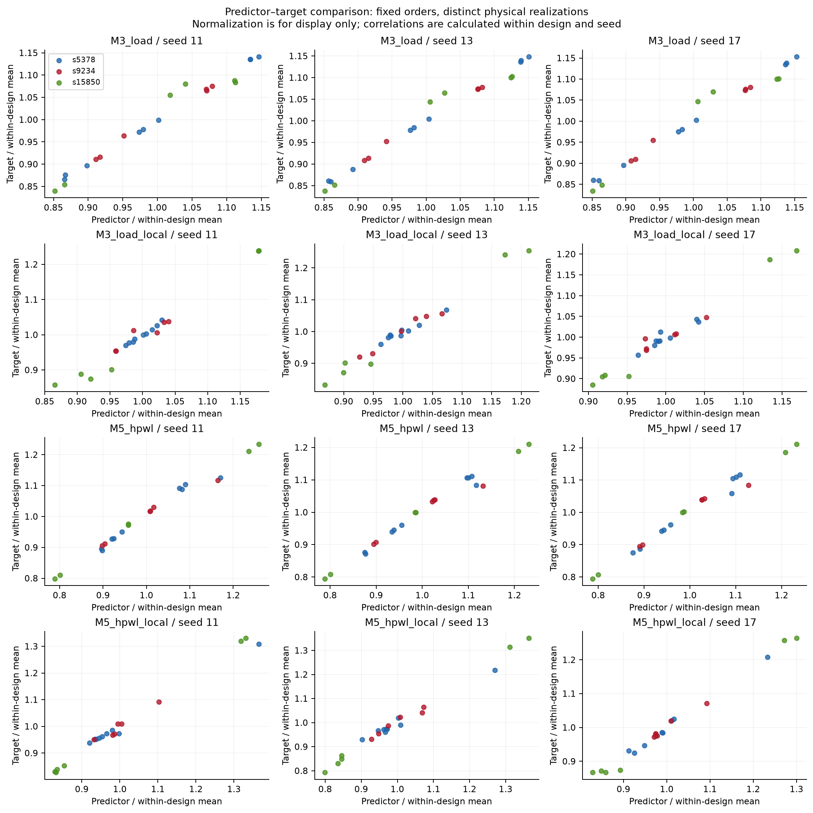
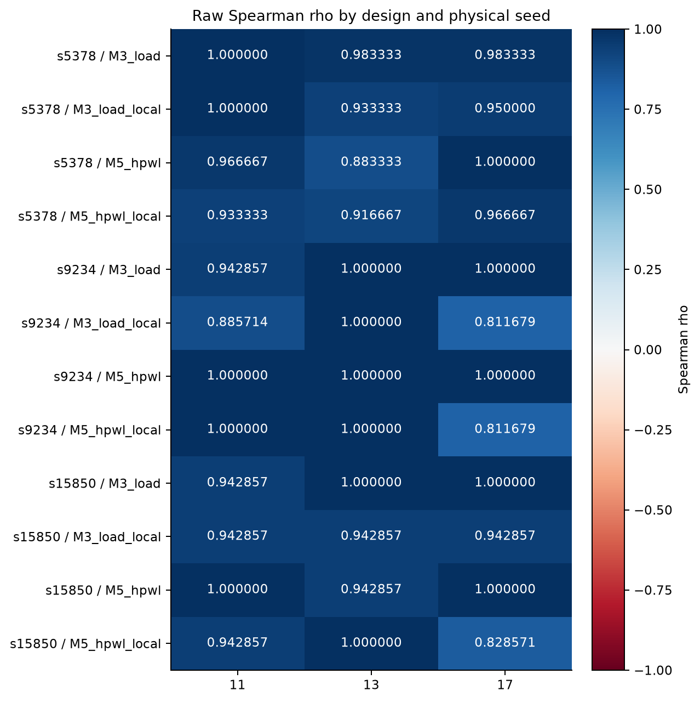
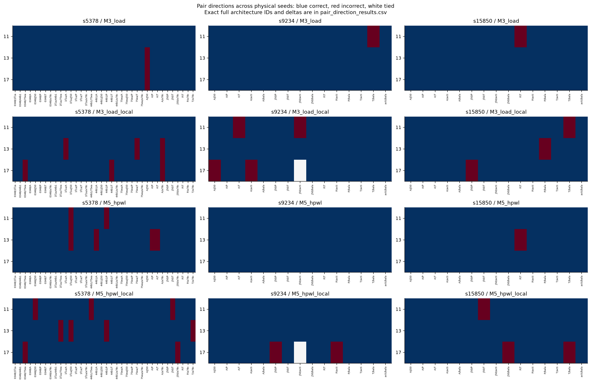
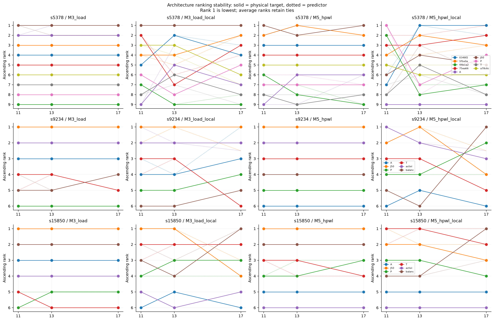
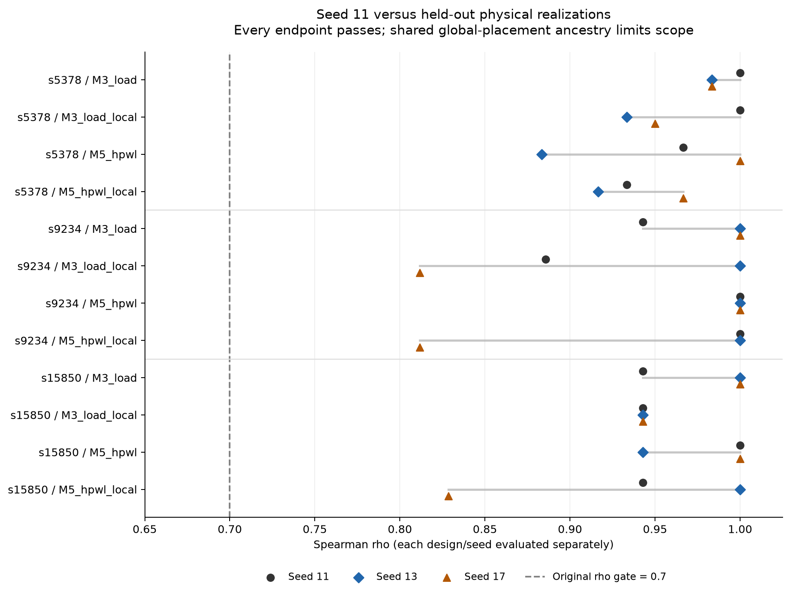

# Phase-2C-R multiseed generalization validation

Primary classification: **PACT_PHASE2CR_MULTISEED_GENERALIZATION_CONFIRMED**.

Scope: three distinct, seeded perturb-and-legalize physical realizations per design (11, 13, 17), descended from one global placement. These are not independent global-placement runs. The 21 fixed scan orders are replicated without architecture search, predictor fitting, threshold tuning or ATPG changes.

Leave-seed-11-out qualification: **PASS**. 12/12 new-seed design/family cells pass both original endpoints. Seed 11 contributes to neither this count nor this conclusion.

## Direct answers

1. **Independent physical seeds tested per design?** Three distinct seeded physical realizations, including two new seeds. Zero independent global-placement runs; common ancestry limits independence and generalization.
2. **Qualifies without seed 11?** Yes within the registered physical-seed regime.
3. **Most stable family?** No unique winner by the stated worst-held-out-rho criterion: M3 and M5 tie at 0.811679449913. Descriptive held-out mean rhos are M3 0.962282811 and M5 0.945814557; means do not alter gates.
4. **Least stable family?** The same minimum-rho criterion is tied, so no unique least-stable family is claimed. Local endpoints are less stable than totals; inspect the separate endpoint ranges and standard deviations below.
5. **Most seed-sensitive design?** s9234 by largest within-endpoint rho range across the three seeds; ranges = {'s5378': 0.1166666666666667, 's9234': 0.18832055008657222, 's15850': 0.17142857142857126}.
6. **Pair directions consistent across all seeds?** 191/264 pair–endpoint comparisons are directionally correct with the same nonzero direction at every seed. 228 are correct at every seed allowing joint direction reversal. There are 66 distinct within-design architecture pairs and four endpoints, not 264 independent observations.
7. **Conclusions dependent on seed 11?** No original endpoint qualification fails on the new seeds, within this limited regime.
8. **Correct rankings but negligible physical effects?** Yes: 89/792 pair–seed–endpoint comparisons are directionally correct with physical change below the preregistered descriptive 1% tolerance. Exact deltas and percentages remain available; this is not a statistical significance or power threshold.
9. **Architecture ordering reversals?** 63/264 physical-target pair–endpoint orderings reverse sign across seeds; 60 predictor orderings reverse. Exact pairs, signs and ties are in pair_consistency.json.
10. **Strong enough for use inside PACT optimization?** Not established by this validation alone. Fixed-order predictive replication does not establish optimization benefit, evaluator throughput, generalization to independent placer runs, other designs/technologies/K, or power/energy accuracy.
11. **Exact scientific blocker?** Independent global-placement generalization and prospective optimization benefit remain untested; the evidence is conditional on a shared placement and a selected small architecture set.
12. **Smallest justified next experiment?** One independently generated global placement per design, using the same 9/6/6 frozen scan orders and original gates (at most 21 exact-order routes). This tests the shared-placement limitation before any optimizer integration. Not started.

## Raw endpoint results

| Design | Seed | Predictor | Spearman rho | Kendall tau-b | Pair accuracy | Correct | Incorrect | Tied | Gate |
|---|---:|---|---:|---:|---:|---:|---:|---:|---|
| s5378 | 11 | M3_load | 1 | 1 | 1 | 36 | 0 | 0 | PASS |
| s5378 | 11 | M3_load_local | 1 | 1 | 1 | 36 | 0 | 0 | PASS |
| s5378 | 11 | M5_hpwl | 0.966666666667 | 0.888888888889 | 0.944444444444 | 34 | 2 | 0 | PASS |
| s5378 | 11 | M5_hpwl_local | 0.933333333333 | 0.833333333333 | 0.916666666667 | 33 | 3 | 0 | PASS |
| s5378 | 13 | M3_load | 0.983333333333 | 0.944444444444 | 0.972222222222 | 35 | 1 | 0 | PASS |
| s5378 | 13 | M3_load_local | 0.933333333333 | 0.833333333333 | 0.916666666667 | 33 | 3 | 0 | PASS |
| s5378 | 13 | M5_hpwl | 0.883333333333 | 0.777777777778 | 0.888888888889 | 32 | 4 | 0 | PASS |
| s5378 | 13 | M5_hpwl_local | 0.916666666667 | 0.777777777778 | 0.888888888889 | 32 | 4 | 0 | PASS |
| s5378 | 17 | M3_load | 0.983333333333 | 0.944444444444 | 0.972222222222 | 35 | 1 | 0 | PASS |
| s5378 | 17 | M3_load_local | 0.95 | 0.833333333333 | 0.916666666667 | 33 | 3 | 0 | PASS |
| s5378 | 17 | M5_hpwl | 1 | 1 | 1 | 36 | 0 | 0 | PASS |
| s5378 | 17 | M5_hpwl_local | 0.966666666667 | 0.888888888889 | 0.944444444444 | 34 | 2 | 0 | PASS |
| s9234 | 11 | M3_load | 0.942857142857 | 0.866666666667 | 0.933333333333 | 14 | 1 | 0 | PASS |
| s9234 | 11 | M3_load_local | 0.885714285714 | 0.733333333333 | 0.866666666667 | 13 | 2 | 0 | PASS |
| s9234 | 11 | M5_hpwl | 1 | 1 | 1 | 15 | 0 | 0 | PASS |
| s9234 | 11 | M5_hpwl_local | 1 | 1 | 1 | 15 | 0 | 0 | PASS |
| s9234 | 13 | M3_load | 1 | 1 | 1 | 15 | 0 | 0 | PASS |
| s9234 | 13 | M3_load_local | 1 | 1 | 1 | 15 | 0 | 0 | PASS |
| s9234 | 13 | M5_hpwl | 1 | 1 | 1 | 15 | 0 | 0 | PASS |
| s9234 | 13 | M5_hpwl_local | 1 | 1 | 1 | 15 | 0 | 0 | PASS |
| s9234 | 17 | M3_load | 1 | 1 | 1 | 15 | 0 | 0 | PASS |
| s9234 | 17 | M3_load_local | 0.811679449913 | 0.690065559342 | 0.857142857143 | 12 | 2 | 1 | PASS |
| s9234 | 17 | M5_hpwl | 1 | 1 | 1 | 15 | 0 | 0 | PASS |
| s9234 | 17 | M5_hpwl_local | 0.811679449913 | 0.690065559342 | 0.857142857143 | 12 | 2 | 1 | PASS |
| s15850 | 11 | M3_load | 0.942857142857 | 0.866666666667 | 0.933333333333 | 14 | 1 | 0 | PASS |
| s15850 | 11 | M3_load_local | 0.942857142857 | 0.866666666667 | 0.933333333333 | 14 | 1 | 0 | PASS |
| s15850 | 11 | M5_hpwl | 1 | 1 | 1 | 15 | 0 | 0 | PASS |
| s15850 | 11 | M5_hpwl_local | 0.942857142857 | 0.866666666667 | 0.933333333333 | 14 | 1 | 0 | PASS |
| s15850 | 13 | M3_load | 1 | 1 | 1 | 15 | 0 | 0 | PASS |
| s15850 | 13 | M3_load_local | 0.942857142857 | 0.866666666667 | 0.933333333333 | 14 | 1 | 0 | PASS |
| s15850 | 13 | M5_hpwl | 0.942857142857 | 0.866666666667 | 0.933333333333 | 14 | 1 | 0 | PASS |
| s15850 | 13 | M5_hpwl_local | 1 | 1 | 1 | 15 | 0 | 0 | PASS |
| s15850 | 17 | M3_load | 1 | 1 | 1 | 15 | 0 | 0 | PASS |
| s15850 | 17 | M3_load_local | 0.942857142857 | 0.866666666667 | 0.933333333333 | 14 | 1 | 0 | PASS |
| s15850 | 17 | M5_hpwl | 1 | 1 | 1 | 15 | 0 | 0 | PASS |
| s15850 | 17 | M5_hpwl_local | 0.828571428571 | 0.733333333333 | 0.866666666667 | 13 | 2 | 0 | PASS |

## Cross-seed stability

All-seed and leave-11-out statistics are separately retained in results.json. SD is the sample SD across the listed seeds, not uncertainty over independent placer optimizations. Undefined values would fail the gates.

| Design | Predictor | Scope | Mean rho | Median | Min | Max | Sample SD | Positive / seeds | Gates passed |
|---|---|---|---:|---:|---:|---:|---:|---:|---:|
| s5378 | M3_load | all_seeds | 0.988888889 | 0.983333333 | 0.983333333 | 1 | 0.00962250449 | 3/3 | 3/3 |
| s5378 | M3_load | leave_seed11_out | 0.983333333 | 0.983333333 | 0.983333333 | 0.983333333 | 0 | 2/2 | 2/2 |
| s5378 | M3_load_local | all_seeds | 0.961111111 | 0.95 | 0.933333333 | 1 | 0.0346944333 | 3/3 | 3/3 |
| s5378 | M3_load_local | leave_seed11_out | 0.941666667 | 0.941666667 | 0.933333333 | 0.95 | 0.011785113 | 2/2 | 2/2 |
| s5378 | M5_hpwl | all_seeds | 0.95 | 0.966666667 | 0.883333333 | 1 | 0.0600925213 | 3/3 | 3/3 |
| s5378 | M5_hpwl | leave_seed11_out | 0.941666667 | 0.941666667 | 0.883333333 | 1 | 0.0824957911 | 2/2 | 2/2 |
| s5378 | M5_hpwl_local | all_seeds | 0.938888889 | 0.933333333 | 0.916666667 | 0.966666667 | 0.0254587539 | 3/3 | 3/3 |
| s5378 | M5_hpwl_local | leave_seed11_out | 0.941666667 | 0.941666667 | 0.916666667 | 0.966666667 | 0.0353553391 | 2/2 | 2/2 |
| s9234 | M3_load | all_seeds | 0.980952381 | 1 | 0.942857143 | 1 | 0.032991444 | 3/3 | 3/3 |
| s9234 | M3_load | leave_seed11_out | 1 | 1 | 1 | 1 | 0 | 2/2 | 2/2 |
| s9234 | M3_load_local | all_seeds | 0.899131245 | 0.885714286 | 0.81167945 | 1 | 0.0948744881 | 3/3 | 3/3 |
| s9234 | M3_load_local | leave_seed11_out | 0.905839725 | 0.905839725 | 0.81167945 | 1 | 0.133162738 | 2/2 | 2/2 |
| s9234 | M5_hpwl | all_seeds | 1 | 1 | 1 | 1 | 0 | 3/3 | 3/3 |
| s9234 | M5_hpwl | leave_seed11_out | 1 | 1 | 1 | 1 | 0 | 2/2 | 2/2 |
| s9234 | M5_hpwl_local | all_seeds | 0.937226483 | 1 | 0.81167945 | 1 | 0.10872692 | 3/3 | 3/3 |
| s9234 | M5_hpwl_local | leave_seed11_out | 0.905839725 | 0.905839725 | 0.81167945 | 1 | 0.133162738 | 2/2 | 2/2 |
| s15850 | M3_load | all_seeds | 0.980952381 | 1 | 0.942857143 | 1 | 0.032991444 | 3/3 | 3/3 |
| s15850 | M3_load | leave_seed11_out | 1 | 1 | 1 | 1 | 0 | 2/2 | 2/2 |
| s15850 | M3_load_local | all_seeds | 0.942857143 | 0.942857143 | 0.942857143 | 0.942857143 | 0 | 3/3 | 3/3 |
| s15850 | M3_load_local | leave_seed11_out | 0.942857143 | 0.942857143 | 0.942857143 | 0.942857143 | 0 | 2/2 | 2/2 |
| s15850 | M5_hpwl | all_seeds | 0.980952381 | 1 | 0.942857143 | 1 | 0.032991444 | 3/3 | 3/3 |
| s15850 | M5_hpwl | leave_seed11_out | 0.971428571 | 0.971428571 | 0.942857143 | 1 | 0.0404061018 | 2/2 | 2/2 |
| s15850 | M5_hpwl_local | all_seeds | 0.923809524 | 0.942857143 | 0.828571429 | 1 | 0.0872871561 | 3/3 | 3/3 |
| s15850 | M5_hpwl_local | leave_seed11_out | 0.914285714 | 0.914285714 | 0.828571429 | 1 | 0.121218305 | 2/2 | 2/2 |

## Interpretation and sensitivity

No failure is removed or averaged away. Family qualification requires both matching total/local endpoints; M3 is paired with capacitance and M5 with routed wire. Exact small-N pair counts, ties, rankings and effect sizes accompany the correlations. No bootstrap, confidence interval or asymptotic significance claim is used. Local peaks remain single-cycle/window maxima under the frozen waveform.
sensitivity_analysis.json retains leave-one-architecture, leave-one-pair, leave-one-seed and leave-one-design descriptive checks. These identify dependence on one case but never change the preregistered result. pair_consistency.json explicitly records prediction sign changes, target sign changes, reversals, ties and negligible effects.

Sensitivity findings: 6/252 leave-one-architecture endpoint analyses fall below an original gate; exact removed architectures are retained in sensitivity_analysis.json. Removing one correct pair causes 0 endpoint accuracy gates to fail. Every leave-one-seed and leave-one-design classification remains CONFIRMED within the registered regime. These post-qualification descriptive deletions do not replace the complete-set result.

Audit scope: topology_audit_raw.json preserves the inherited output. clarify_topology_scope.py marks its seed-11-only legacy archive summary flag as not applicable for new seeds. Every topology assertion passed unchanged; no topology, predictor, target or qualification gate was relaxed.

## Physical execution and audit

20 new routes completed; 4 additional exact-order archived routes were reused for extraction. All 18 previously complete seed-13/17 s5378 physical cases and all 21 repaired seed-11 cases were reused. All 63 topology cases qualify (42 new-seed audits plus 21 frozen seed-11 proofs). New-source topology adaptation changes only the hardcoded seed selector; every original topology assertion is retained. The corrected predictor and scoring sources are unchanged.
Focused tests: 21 passed. Full repository regression: 224 passed, 0 failures, 0 errors, 0 skipped. Existing seed-11 outputs and Attempt 1 remain byte-identical. Raw physical executions retain commands, stdout/stderr, timing, DRC, structure proofs, SPEF and runtime under raw/. New negative STA slack, where present, is disclosed in structured metrics; the inherited contract does not impose a zero-slack gate.
No optimizer, ML, ATPG, Phase-2D or push occurred. The contract predates new outcomes. result_provenance.json and manifest.sha256 cover frozen inputs, reused evidence, sources, contract and outputs; the manifest excludes itself.

## Figures

