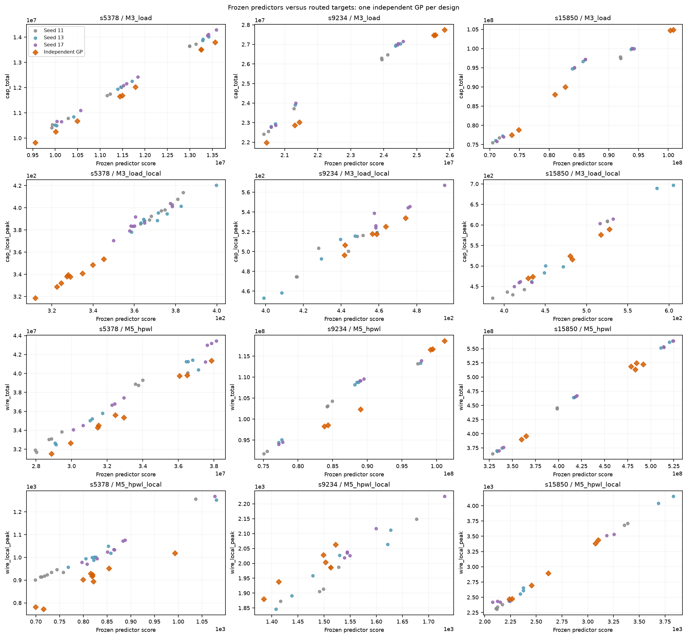
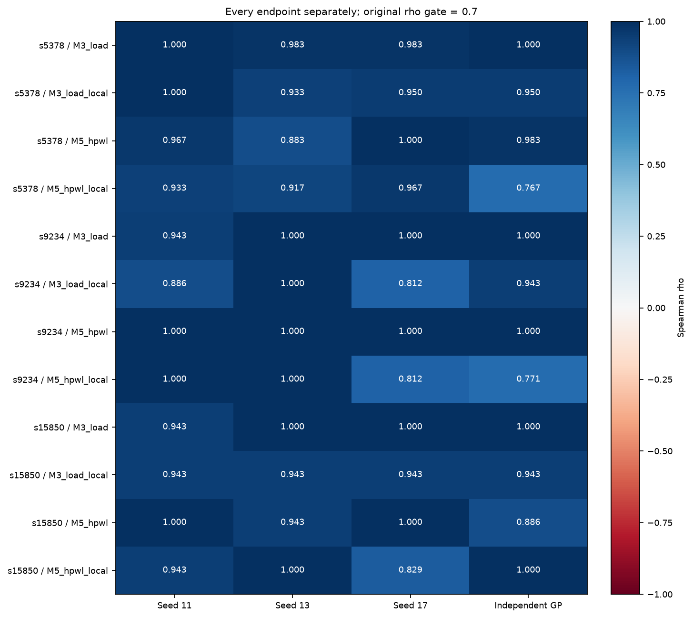
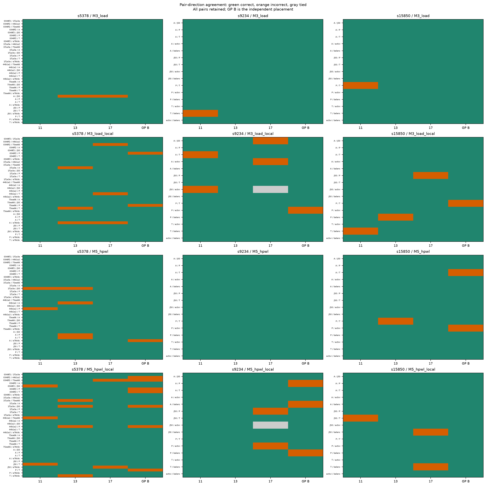
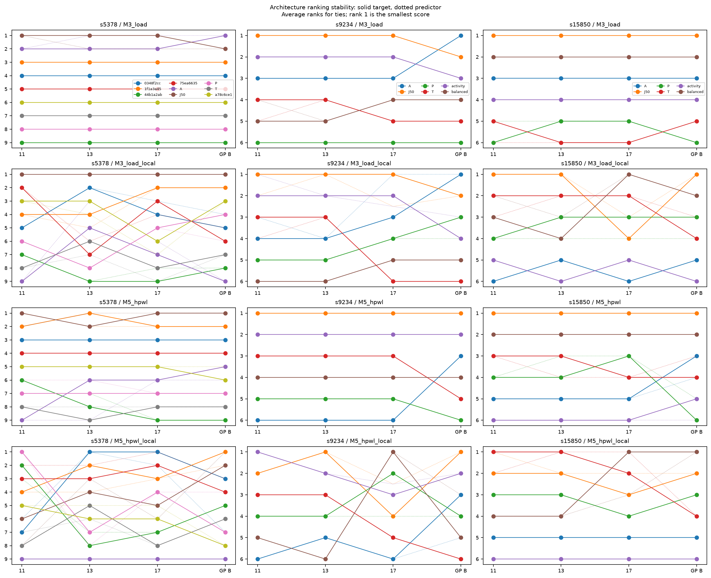
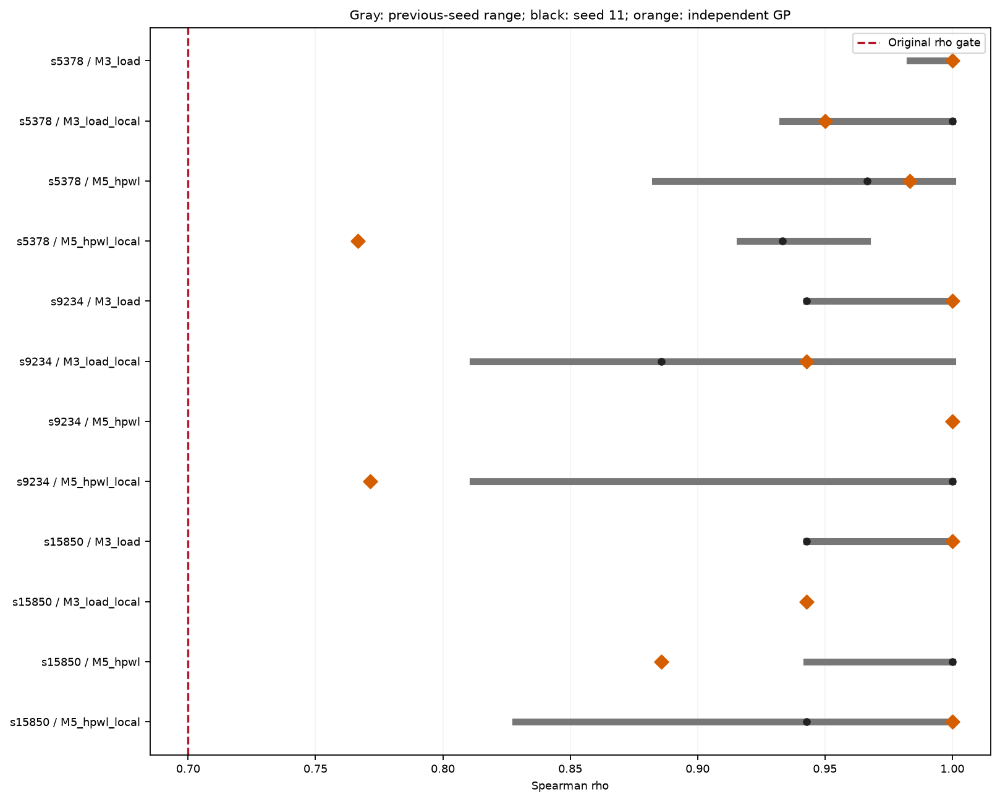

# PACT Phase-2D independent global-placement validation

**PACT_PHASE2D_INDEPENDENT_GP_GENERALIZATION_CONFIRMED**

The frozen M3/M5 predictor-target relationships replicated on one independently generated global placement per design under the tested technology, benchmark and architecture regime.

## Method and independence

The installed OpenROAD 26Q2-1164-g08f67ee5ec does not expose a global-placement random-seed flag. The contract therefore preregistered seed 29 for Python random.Random scratch initialization from each retained 2_floorplan.odb. Every movable input instance had NONE/UNPLACED status. Coordinates were sampled from core bounds, with no old placed coordinates read. Both ORFS global-placement stages then ran, followed by the qualified resizing and detailed-placement steps. The hook removes force_center_initial_place and uses skip_initial_place to preserve that new initialization. This tests a fresh seeded initialization regime; it is not a native OpenROAD seed-only perturbation of otherwise identical GP settings.

The ancestry is pre-GP floorplan → fresh initialization → skip-IO GP → new IO placement → final GP → resize/detail placement. Independent placement commands, logs, original unplaced statuses, generated coordinates and intermediate/final hashes are retained. Phase-2C seed-11 DEFs were read only afterward for descriptive comparison. Coordinate differences alone are corroboration, not the causal proof.

All 21 frozen logical architecture IDs and scan-order hashes are recorded in contract.json. Physical serialization hashes naturally differ with coordinates. Pattern, FF identity and packed activity hashes were verified; ATPG was not regenerated. Predictors, target extraction, exact tie statistics, coefficient 0.103981, 10x10 bins, 81 contained 2x2 windows and all topology assertions remain unchanged.

Contract SHA256: `05a9ddf902f90c00bb57da72251bd0805390d6e7415328e485a9f8073383205e`. Original gates: rho ≥ 0.7 and non-tied accuracy ≥ 0.75 for each endpoint; undefined fails. No pooled rescue.

## Endpoint results

| Design | Predictor | rho 11 | rho 13 | rho 17 | Independent rho | Delta vs 11 | tau-b | Accuracy | Correct / incorrect / tied | Pass |
|---|---|---:|---:|---:|---:|---:|---:|---:|---|---|
| s5378 | M3_load | 1.000000 | 0.983333 | 0.983333 | 1.000000 | 0.000000 | 1.000000 | 1.000000 | 36 / 0 / 0 | True |
| s5378 | M3_load_local | 1.000000 | 0.933333 | 0.950000 | 0.950000 | -0.050000 | 0.888889 | 0.944444 | 34 / 2 / 0 | True |
| s5378 | M5_hpwl | 0.966667 | 0.883333 | 1.000000 | 0.983333 | 0.016667 | 0.944444 | 0.972222 | 35 / 1 / 0 | True |
| s5378 | M5_hpwl_local | 0.933333 | 0.916667 | 0.966667 | 0.766667 | -0.166667 | 0.611111 | 0.805556 | 29 / 7 / 0 | True |
| s9234 | M3_load | 0.942857 | 1.000000 | 1.000000 | 1.000000 | 0.057143 | 1.000000 | 1.000000 | 15 / 0 / 0 | True |
| s9234 | M3_load_local | 0.885714 | 1.000000 | 0.811679 | 0.942857 | 0.057143 | 0.866667 | 0.933333 | 14 / 1 / 0 | True |
| s9234 | M5_hpwl | 1.000000 | 1.000000 | 1.000000 | 1.000000 | 0.000000 | 1.000000 | 1.000000 | 15 / 0 / 0 | True |
| s9234 | M5_hpwl_local | 1.000000 | 1.000000 | 0.811679 | 0.771429 | -0.228571 | 0.600000 | 0.800000 | 12 / 3 / 0 | True |
| s15850 | M3_load | 0.942857 | 1.000000 | 1.000000 | 1.000000 | 0.057143 | 1.000000 | 1.000000 | 15 / 0 / 0 | True |
| s15850 | M3_load_local | 0.942857 | 0.942857 | 0.942857 | 0.942857 | 0.000000 | 0.866667 | 0.933333 | 14 / 1 / 0 | True |
| s15850 | M5_hpwl | 1.000000 | 0.942857 | 1.000000 | 0.885714 | -0.114286 | 0.733333 | 0.866667 | 13 / 2 / 0 | True |
| s15850 | M5_hpwl_local | 0.942857 | 1.000000 | 0.828571 | 1.000000 | 0.057143 | 1.000000 | 1.000000 | 15 / 0 / 0 | True |

## Mandatory direct answers

1. **Independent from pre-GP state?** Yes, for all three designs; one new placement per design.
2. **Evidence of no Phase-2C placed ancestry?** The input floorplan hashes and all-movable-unplaced status audit, seeded initialization coordinate records, commands loading only the new ancestry, GP logs and DEF/ODB hashes are in independent_placement_proof.json and execution/. The Phase-2C comparison DEF is accessed only after placement.
3. **New exact-order implementations?** 21 (budget 21).
4. **Every endpoint passes?** Yes, 12/12.
5. **Worst independent rho?** 0.766667.
6. **Most affected endpoint?** s9234 / M5_hpwl_local, rho change -0.228571 from seed 11; ties are visible in endpoint_comparison.csv.
7. **Are total predictors more stable?** Total predictors show a smaller mean absolute rho change: total mean absolute change 0.040873016, local 0.093253968. This descriptive summary never rescues an endpoint.
8. **Target reversals?** 86 of 264 unique pair-endpoints reverse relative to at least one prior seed. Per-seed counts: 11: 60, 13: 51, 17: 49.
9. **Predictor reversals?** 77 unique pair-endpoints; per-seed counts: 11: 48, 13: 54, 17: 38.
10. **Correct predictions with <1% target difference?** Yes: 18 independent pair-endpoints. This is a descriptive tolerance, not statistical significance.
11. **May these predictors be used in a prospective optimizer experiment?** The tested physical-generalization prerequisite is satisfied within this regime; this supports preregistering a bounded prospective optimizer experiment, not claiming optimizer benefit.
12. **Exact blocker?** No remaining Phase-2D gate blocker in the tested regime. Broader validity and optimization benefit remain untested.
13. **Smallest justified next experiment?** A separately preregistered, bounded prospective comparison of a frozen predictor-guided selection rule against fixed baseline architectures, with held-out routed outcomes and unchanged ATPG. Phase-3 was not started.

## Verification and limits

Focused tests: 26 passed. Full repository regression: 229 passed. New physical/topology checks: 21/21. Upstream manifests and final byte-preservation checks are in initial_integrity.json, final_integrity.json and result_provenance.json.

One independent GP per design is a limited replication. No inference is made across technologies, arbitrary designs, power, IR drop, ATPG quality, production readiness or optimization benefit. Seeded scratch initialization and the changed GP initialization mode must remain part of the stated scope. All failed attempts, if any, are preserved. No push and no Phase-3.

## Figures

